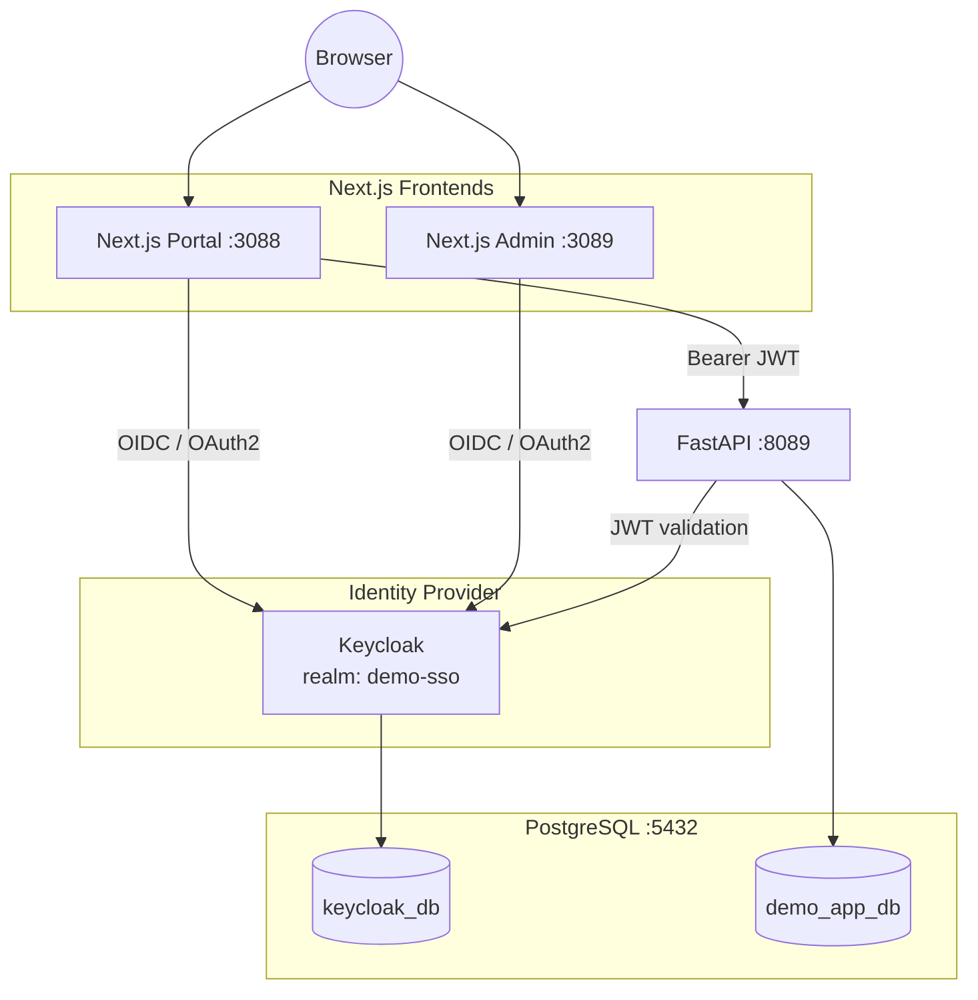

# Demo SSO — Keycloak + Next.js + FastAPI + PostgreSQL

A hands-on, fully working demo of **Single Sign-On (SSO)** using **Keycloak** as the Identity
Provider, secured with **OAuth 2.0 / OpenID Connect**, running **natively on Windows — no
Docker**. Two independent frontend applications share one Keycloak realm and one user, proving
that logging in once grants access to both without re-entering credentials.

## Stack

| Component | Technology | Port |
|---|---|---|
| Identity Provider | Keycloak 26.7.3 | `8088` |
| Frontend — Portal | Next.js 16 (App Router) + Auth.js | `3088` |
| Frontend — Admin | Next.js 16 (App Router) + Auth.js | `3089` |
| Backend API | FastAPI (Python) | `8089` |
| Database | PostgreSQL 17 | `5432` |

## Architecture



One Keycloak, one realm (`demo-sso`), two registered clients (`nextjs-portal`, `nextjs-admin`),
one shared user (`demo.user`). Keycloak's own database is kept fully separate from the
application's business data.

## Quick Start

```powershell
git clone https://github.com/seeomkus/demo-keycloak.git
cd demo-keycloak
```

Prerequisites already installed and running locally: PostgreSQL 17, Java 21 (for Keycloak), Node.js,
Python. See [docs/phase-00-environment-audit.md](docs/phase-00-environment-audit.md) through
[phase-04](docs/phase-04-configure-keycloak-database.md) for the full native setup from scratch.

Once everything is installed and configured:

```powershell
scripts\start.bat     # starts Keycloak, FastAPI, both Next.js apps in the background
scripts\status.bat    # check what's up
scripts\stop.bat      # stop everything
scripts\restart.bat   # stop + start
```

Then open the live demo: **http://localhost:3088/flow-demo**

Demo login: `demo.user` / `DemoUser@123`

### Running from another device on the same network

If accessing from a LAN client instead of the machine running the services:

```powershell
scripts\update-ip.bat   # detects the current LAN IP and syncs it into every config
scripts\restart.bat
```

Then open `http://<LAN-IP>:3088/flow-demo` from the other device.

## Documentation

Full documentation — including a from-scratch build log across 20 phases, a Keycloak concepts
guide, a stack-agnostic Keycloak integration reference, and a presenter's demo guide — lives in
[`docs/`](docs/README.md).

| Start here | For |
|---|---|
| [docs/README.md](docs/README.md) | Full phase index and baseline configuration |
| [docs/PROJECT-SUMMARY.md](docs/PROJECT-SUMMARY.md) | Complete end-to-end project summary, with links to every other document |
| [docs/PROJECT-OVERVIEW.md](docs/PROJECT-OVERVIEW.md) | Same big-picture summary as a standalone read, with no links out to other docs |
| [docs/DEMO-GUIDE.md](docs/DEMO-GUIDE.md) *(also [.html](docs/DEMO-GUIDE.html))* | Click-by-click guide to running the demo live |
| [docs/KEYCLOAK-GUIDE.md](docs/KEYCLOAK-GUIDE.md) | Keycloak concepts from scratch (realm, client, user, session) |
| [docs/KEYCLOAK-IMPLEMENTATION-GUIDE.md](docs/KEYCLOAK-IMPLEMENTATION-GUIDE.md) *(also [.html](docs/KEYCLOAK-IMPLEMENTATION-GUIDE.html))* | GUI-first install/deploy/maintain/troubleshoot runbook for Keycloak itself |
| [docs/KEYCLOAK-CODE-SNIPPETS.md](docs/KEYCLOAK-CODE-SNIPPETS.md) *(also [.html](docs/KEYCLOAK-CODE-SNIPPETS.html))* | Ready-to-adapt integration code for 4 backends and 5 frontends |
| [docs/KEYCLOAK-MULTI-STACK-FLOW.md](docs/KEYCLOAK-MULTI-STACK-FLOW.md) *(also [.html](docs/KEYCLOAK-MULTI-STACK-FLOW.html))* | Keycloak integration across other frontend/backend/database stacks |

## Project Layout

```text
demo-keycloak/
├── nextjs-portal/     Next.js app — Portal (client: nextjs-portal)
├── nextjs-admin/      Next.js app — Admin (client: nextjs-admin)
├── fastapi-app/        FastAPI backend, validates Keycloak-issued JWTs
├── scripts/            start/stop/status/restart/update-ip .bat scripts
└── docs/                Full documentation (phase-by-phase build log + guides)
```

Keycloak itself is installed outside this repository (`C:\Keycloak\`), since it's a standalone
server, not an application dependency — see [docs/phase-02-install-keycloak.md](docs/phase-02-install-keycloak.md).

## Security Note

This is a **local development demo**. Passwords, client secrets, and tokens shown throughout the
docs are demo-only values, regenerated for this environment — never production credentials.
Everything runs over plain HTTP on `localhost`/the local LAN. See
[docs/phase-19-security-review.md](docs/phase-19-security-review.md) for what must change before
any of this is used in production (HTTPS, secret management, hardened Keycloak config, etc.).
