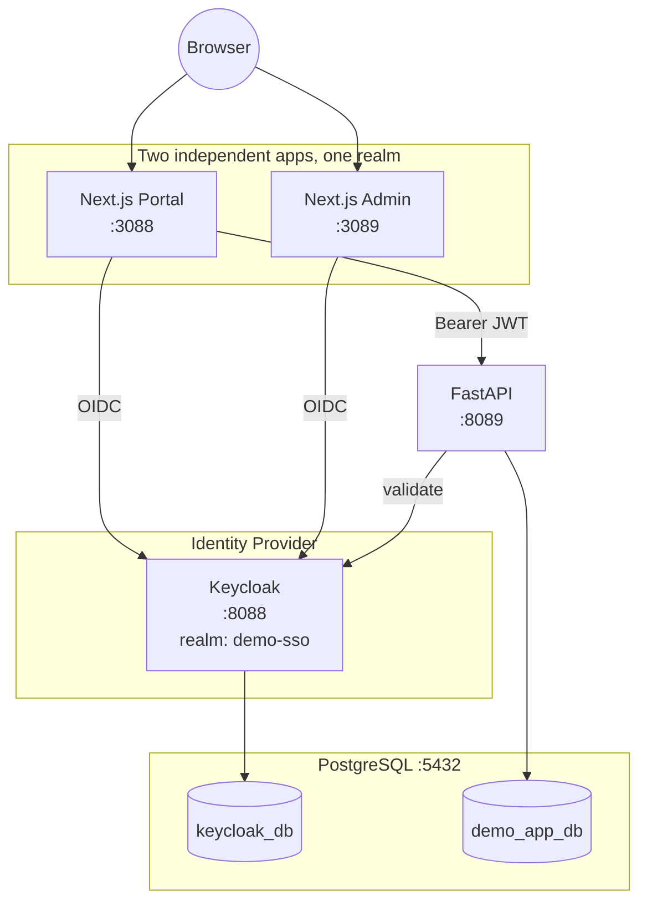

# SSO Demo — Presenter's Guide

**A click-by-click walkthrough for running this demo live**, from a cold start to a full teardown. For the technical build details behind each step, see the linked phase docs.

Baseline: [docs/README.md](README.md) · Full build record: [Phase 0](phase-00-environment-audit.md) → [Phase 20](phase-20-final-documentation.md)

---

## 0. Before You Start

| Component | URL | Credential |
|---|---|---|
| Keycloak Admin Console | http://localhost:8088/admin | `admin` / `admin123` |
| Next.js Portal | http://localhost:3088 | — |
| Next.js Admin | http://localhost:3089 | — |
| FastAPI | http://localhost:8089 | — |
| Demo user (for login) | — | `demo.user` / `DemoUser@123` |

Open **two browser tabs in the same browser window** (not two different browsers, and not two Incognito windows — SSO relies on shared cookies) — one for the Portal, one for the Admin app.

---

## 1. Start Every Service

Run each of these in its own terminal (or background task), in this order:

```powershell
# 1. PostgreSQL — usually already running as a Windows service
Get-Service postgresql-x64-17
# If not running:
Start-Service postgresql-x64-17
```

```bash
# 2. Keycloak
cd C:\Keycloak\keycloak-26.7.3\bin
KC_DB_PASSWORD=keycloak_demo_pass KC_BOOTSTRAP_ADMIN_USERNAME=admin KC_BOOTSTRAP_ADMIN_PASSWORD=admin123 \
  ./kc.bat start-dev --http-port=8088
```

```bash
# 3. FastAPI
cd fastapi-app
venv/Scripts/python.exe -m uvicorn main:app --host 0.0.0.0 --port 8089
```

```bash
# 4. Next.js Portal
cd nextjs-portal
npm run dev
```

```bash
# 5. Next.js Admin
cd nextjs-admin
npm run dev
```

### Verify everything is up

```powershell
foreach ($p in @{8088="Keycloak";8089="FastAPI";3088="Portal";3089="Admin"}.GetEnumerator()) {
  try { $r = Invoke-WebRequest "http://localhost:$($p.Key)" -UseBasicParsing -TimeoutSec 5; "$($p.Value): HTTP $($r.StatusCode)" }
  catch { "$($p.Value): $($_.Exception.Message)" }
}
```

All four should respond (Keycloak's root path returns a redirect — that's normal and means it's alive).

Full install/config details: [Phase 2](phase-02-install-keycloak.md) · [Phase 3](phase-03-postgresql.md) · [Phase 4](phase-04-configure-keycloak-database.md) · [Phase 8](phase-08-nextjs-portal.md) · [Phase 11](phase-11-fastapi.md) · [Phase 14](phase-14-nextjs-admin.md)

---

## 2. Walk the Architecture (talking points)

Before clicking anything, it helps to show the shape of the system:



**Say this out loud:** "One Keycloak, one realm, two separate client applications, one shared user. Keycloak owns authentication; Next.js owns the UI; FastAPI owns business logic and talks to its own database — completely separate from Keycloak's own database."

---

## 3. Demo Step 1 — Login on the Portal

**Tab 1 → http://localhost:3088**

1. Click **Login**.
2. You land on Keycloak's own login page (`localhost:8088`) — point out: *"this is not the Portal's page, this is Keycloak's — the Portal never sees the password."*
3. Enter:
   - Username: `demo.user`
   - Password: `DemoUser@123`
4. You're redirected back to the Portal, landing on `/profile`.

**What to point out on `/profile`:**
- Identity claims shown: Username, Email, Name, Subject, Issuer.
- **No access token, refresh token, or client secret is ever shown** — say this explicitly, it's a deliberate security choice.
- Scroll to **"FastAPI Backend Call"** — this section proves the Portal's server called FastAPI with a Bearer token and got `HTTP 200` back, without the browser ever talking to FastAPI directly.

Reference: [Phase 8](phase-08-nextjs-portal.md), [Phase 12](phase-12-nextjs-fastapi-integration.md)

---

## 4. Demo Step 2 — Single Sign-On (the main event)

**Do not log out of the Portal.**

**Tab 2 → http://localhost:3089**

1. Click **Login**.
2. **Watch closely: no login form appears.** You are redirected straight through Keycloak and land on `/profile` already authenticated as `demo.user`.

**Say this out loud:** *"I did not type a username or password into this second app. Keycloak recognized my existing session from the Portal and vouched for my identity automatically. That's Single Sign-On."*

The Admin home page (`/`) also prints this explanation for the audience if you land there first.

Reference: [Phase 15](phase-15-sso-demonstration.md) — includes the raw HTTP proof (Keycloak issuing an authorization code with zero login form) if a technical audience wants to see it.

---

## 5. Demo Step 3 — Show the API and Database Layer (optional, for a technical audience)

```bash
# Public endpoint — no auth needed
curl http://localhost:8089/api/public

# Product data — read from demo_app_db, independent of Keycloak's own database
curl http://localhost:8089/api/products

# Add a product
curl -X POST http://localhost:8089/api/products \
  -H "Content-Type: application/json" \
  -d '{"name": "Demo Item", "price": 99000}'
```

Point out: business data lives in `demo_app_db`; Keycloak's own identity data lives in a completely separate database, `keycloak_db` — they never mix.

Reference: [Phase 11](phase-11-fastapi.md), [Phase 13](phase-13-postgresql-application-database.md)

---

## 6. Demo Step 4 — Logout, Three Ways

### A) Logout from the Portal only

In **Tab 1**, click **Logout**.

- Portal: now logged out.
- **Switch to Tab 2 (Admin) and refresh** — still logged in.

**Say this out loud:** *"Logging out of one app does not touch the other — each app's own session is independent."*

### B) Logout from the Admin too

In **Tab 2**, click **Logout**.

- Both apps are now logged out **at the application level**.
- But the Keycloak SSO session is *still alive* underneath — if you click Login again on either app right now, it will log you back in with zero credentials (try it, then click Logout again before continuing, to reset state).

### C) True full logout (ends the Keycloak SSO session)

Navigate to:

```text
http://localhost:8088/realms/demo-sso/protocol/openid-connect/logout?client_id=nextjs-portal&post_logout_redirect_uri=http://localhost:3088
```

Confirm the **"Do you want to log out?"** prompt Keycloak shows.

- Now click **Login** on either app — the real Keycloak login form appears again, asking for `demo.user`'s password. The SSO session is genuinely gone.

Reference: [Phase 16](phase-16-logout.md) — includes the Application Session vs. Keycloak SSO Session distinction in full, plus a real bug that was diagnosed and fixed along the way.

---

## 7. Wrap-Up Talking Points

- **One login, many apps** — the core SSO value proposition, just demonstrated live.
- **Keycloak never hands out the password** — every login happened on Keycloak's own page, not inside either app.
- **Tokens never touch the browser** — access tokens are exchanged and used entirely server-side (Portal ↔ FastAPI).
- **Two kinds of "logged in"** — an app session and a Keycloak SSO session are different things, with different lifetimes and different logout triggers.
- **Everything is native, no containers** — every piece (Keycloak, PostgreSQL, Next.js ×2, FastAPI) runs as a plain Windows process.

---

## 8. Shutting Down

```bash
# Stop Next.js Portal, Next.js Admin, FastAPI (Ctrl+C in each terminal, or):
taskkill //F //IM node.exe
taskkill //F //IM python.exe

# Stop Keycloak
taskkill //F //IM java.exe

# PostgreSQL can be left running (Windows service) or:
Stop-Service postgresql-x64-17
```

All configuration (realm, clients, users, `products` table) is persisted in PostgreSQL — nothing needs to be recreated for the next run. Just start the services again as in [Section 1](#1-start-every-service).

---

## Troubleshooting During a Live Demo

If something misbehaves mid-demo, check [Phase 17 — Troubleshooting](phase-17-troubleshooting.md) first — it covers port conflicts, invalid redirect URI, login loops, CORS, 401s, JWT/audience/issuer mismatches, and more, each with a `SYMPTOM → CAUSE → CHECK → FIX → VERIFY` recipe.
