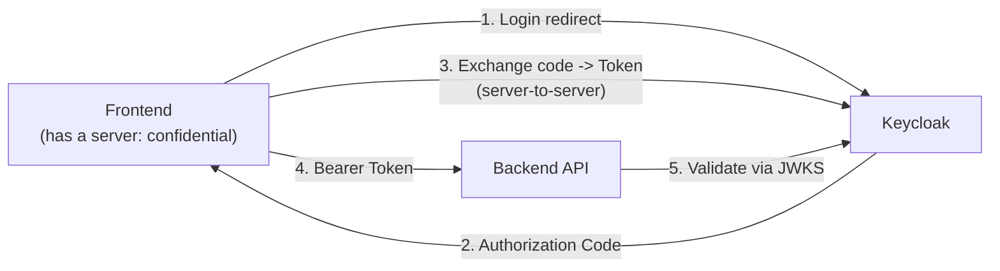

# Keycloak Configuration Code — Backend & Frontend

A collection of **real code snippets** for connecting an application to Keycloak, covering 4 backend platforms and 5 frontend platforms. All examples use the same configuration values (adjust to your own realm/client):

```text
Keycloak URL   : http://localhost:8088
Realm          : demo-sso
Client ID      : (differs per application, see each example)
Client Secret  : (from Keycloak Admin Console -> Clients -> Credentials)
```

> 📌 For how to create the realm/client in Keycloak itself, see [KEYCLOAK-IMPLEMENTATION-GUIDE.md](KEYCLOAK-IMPLEMENTATION-GUIDE.md). This document focuses purely on **application-side code**.

---

## Table of Contents

**Backend (JWT validation / resource server):**
1. [TypeScript (Node.js / Express)](#1-typescript-nodejs--express)
2. [Python (FastAPI)](#2-python-fastapi)
3. [Golang](#3-golang)
4. [.NET (ASP.NET Core Web API)](#4-net-aspnet-core-web-api)

**Frontend (login / OIDC client):**
5. [.NET (ASP.NET Core MVC)](#5-net-aspnet-core-mvc)
6. [Laravel](#6-laravel)
7. [Next.js](#7-nextjs)
8. [React.js (SPA)](#8-reactjs-spa)
9. [Vue.js (SPA)](#9-vuejs-spa)

---

## The Common Flow Behind Every Example



The backend **never** handles login — it only receives `Authorization: Bearer <token>` and validates it on its own (signature, issuer, expiry) using Keycloak's public key (JWKS). A frontend with its own server (Next.js, Laravel, .NET MVC) handles login through the Authorization Code Flow.

---

## 1. TypeScript (Node.js / Express)

Pure backend — JWT validation, no login logic.

```bash
npm install express jsonwebtoken jwks-rsa
```

```ts
// jwtAuth.ts
import jwt, { JwtHeader, SigningKeyCallback } from "jsonwebtoken";
import jwksClient from "jwks-rsa";
import { Request, Response, NextFunction } from "express";

const KEYCLOAK_ISSUER = "http://localhost:8088/realms/demo-sso";
const JWKS_URI = `${KEYCLOAK_ISSUER}/protocol/openid-connect/certs`;

const client = jwksClient({ jwksUri: JWKS_URI, cache: true, cacheMaxAge: 300_000 });

function getSigningKey(header: JwtHeader, callback: SigningKeyCallback) {
  client.getSigningKey(header.kid!, (err, key) => {
    if (err) return callback(err);
    callback(null, key!.getPublicKey());
  });
}

export function requireAuth(req: Request, res: Response, next: NextFunction) {
  const authHeader = req.headers.authorization;
  if (!authHeader?.startsWith("Bearer ")) {
    return res.status(401).json({ error: "Missing Authorization: Bearer <token>" });
  }
  const token = authHeader.slice(7);

  jwt.verify(
    token,
    getSigningKey,
    { issuer: KEYCLOAK_ISSUER, algorithms: ["RS256"] },
    (err, decoded) => {
      if (err) return res.status(401).json({ error: `Invalid token: ${err.message}` });
      (req as any).user = decoded; // sub, preferred_username, email, azp, etc.
      next();
    }
  );
}
```

```ts
// server.ts
import express from "express";
import { requireAuth } from "./jwtAuth";

const app = express();

app.get("/api/public", (_req, res) => {
  res.json({ message: "Public endpoint, no auth needed" });
});

app.get("/api/profile", requireAuth, (req, res) => {
  const user = (req as any).user;
  res.json({ username: user.preferred_username, email: user.email, sub: user.sub });
});

app.listen(8089, () => console.log("API running on :8089"));
```

---

## 2. Python (FastAPI)

This is the exact pattern used by this project itself — validation via `python-jose` plus JWKS caching.

```bash
pip install fastapi uvicorn "python-jose[cryptography]" httpx
```

```python
# jwt_auth.py
import os, time
import httpx
from fastapi import HTTPException, status
from jose import jwt

KEYCLOAK_ISSUER = "http://localhost:8088/realms/demo-sso"
KEYCLOAK_JWKS_URL = f"{KEYCLOAK_ISSUER}/protocol/openid-connect/certs"

_jwks_cache = {"keys": None, "fetched_at": 0.0}

def _get_jwks() -> dict:
    now = time.time()
    if _jwks_cache["keys"] is None or (now - _jwks_cache["fetched_at"]) > 300:
        resp = httpx.get(KEYCLOAK_JWKS_URL, timeout=5.0)
        resp.raise_for_status()
        _jwks_cache["keys"] = resp.json()
        _jwks_cache["fetched_at"] = now
    return _jwks_cache["keys"]

def validate_access_token(token: str) -> dict:
    try:
        jwks = _get_jwks()
        header = jwt.get_unverified_header(token)
        key = next((k for k in jwks["keys"] if k["kid"] == header["kid"]), None)
        if key is None:
            raise HTTPException(status.HTTP_401_UNAUTHORIZED, "Unknown signing key")

        return jwt.decode(
            token, key,
            algorithms=[header.get("alg", "RS256")],
            issuer=KEYCLOAK_ISSUER,
            options={"verify_aud": False},  # Keycloak's default aud is "account", use azp instead if needed
        )
    except Exception as exc:
        raise HTTPException(status.HTTP_401_UNAUTHORIZED, f"Invalid token: {exc}")
```

```python
# main.py
from fastapi import Depends, FastAPI
from fastapi.security import HTTPAuthorizationCredentials, HTTPBearer
from jwt_auth import validate_access_token

app = FastAPI()
bearer_scheme = HTTPBearer(auto_error=False)

def require_token(creds: HTTPAuthorizationCredentials | None = Depends(bearer_scheme)) -> dict:
    if creds is None:
        from fastapi import HTTPException, status
        raise HTTPException(status.HTTP_401_UNAUTHORIZED, "Missing Bearer token")
    return validate_access_token(creds.credentials)

@app.get("/api/public")
def public():
    return {"message": "Public endpoint, no auth needed"}

@app.get("/api/profile")
def profile(claims: dict = Depends(require_token)):
    return {"username": claims.get("preferred_username"), "email": claims.get("email")}
```

---

## 3. Golang

Uses `go-oidc` — the official-style OIDC verifier, which automatically fetches the discovery document and JWKS.

```bash
go get github.com/coreos/go-oidc/v3/oidc
```

```go
// main.go
package main

import (
	"context"
	"encoding/json"
	"net/http"
	"strings"

	"github.com/coreos/go-oidc/v3/oidc"
)

const keycloakIssuer = "http://localhost:8088/realms/demo-sso"

var verifier *oidc.IDTokenVerifier

func requireAuth(next http.HandlerFunc) http.HandlerFunc {
	return func(w http.ResponseWriter, r *http.Request) {
		authHeader := r.Header.Get("Authorization")
		if !strings.HasPrefix(authHeader, "Bearer ") {
			http.Error(w, `{"error":"Missing Authorization: Bearer <token>"}`, http.StatusUnauthorized)
			return
		}
		token := strings.TrimPrefix(authHeader, "Bearer ")

		idToken, err := verifier.Verify(r.Context(), token)
		if err != nil {
			http.Error(w, `{"error":"Invalid token: `+err.Error()+`"}`, http.StatusUnauthorized)
			return
		}

		var claims map[string]interface{}
		idToken.Claims(&claims)
		r = r.WithContext(context.WithValue(r.Context(), "claims", claims))
		next(w, r)
	}
}

func main() {
	provider, err := oidc.NewProvider(context.Background(), keycloakIssuer)
	if err != nil {
		panic(err)
	}
	// SkipClientIDCheck because Keycloak's default aud is "account", not the client ID -- check azp instead if needed.
	verifier = provider.Verifier(&oidc.Config{SkipClientIDCheck: true})

	http.HandleFunc("/api/public", func(w http.ResponseWriter, r *http.Request) {
		json.NewEncoder(w).Encode(map[string]string{"message": "Public endpoint, no auth needed"})
	})

	http.HandleFunc("/api/profile", requireAuth(func(w http.ResponseWriter, r *http.Request) {
		claims := r.Context().Value("claims").(map[string]interface{})
		json.NewEncoder(w).Encode(map[string]interface{}{
			"username": claims["preferred_username"],
			"email":    claims["email"],
		})
	}))

	http.ListenAndServe(":8089", nil)
}
```

---

## 4. .NET (ASP.NET Core Web API)

The built-in `Microsoft.AspNetCore.Authentication.JwtBearer` middleware — automatic validation, no manual JWT parsing needed.

```bash
dotnet add package Microsoft.AspNetCore.Authentication.JwtBearer
```

```csharp
// Program.cs
using Microsoft.AspNetCore.Authentication.JwtBearer;

var builder = WebApplication.CreateBuilder(args);

builder.Services.AddAuthentication(JwtBearerDefaults.AuthenticationScheme)
    .AddJwtBearer(options =>
    {
        options.Authority = "http://localhost:8088/realms/demo-sso";
        options.RequireHttpsMetadata = false; // localhost/dev only
        options.TokenValidationParameters = new()
        {
            ValidateAudience = false, // Keycloak's default aud is "account", not the client ID
            ValidateIssuer = true,
        };
    });

builder.Services.AddAuthorization();

var app = builder.Build();
app.UseAuthentication();
app.UseAuthorization();

app.MapGet("/api/public", () => new { message = "Public endpoint, no auth needed" });

app.MapGet("/api/profile", (HttpContext ctx) =>
{
    var user = ctx.User;
    return new
    {
        username = user.FindFirst("preferred_username")?.Value,
        email = user.FindFirst("email")?.Value,
    };
}).RequireAuthorization();

app.Run();
```

---

## 5. .NET (ASP.NET Core MVC)

A frontend with its own server — uses the built-in OIDC middleware, with the redirect & callback handled automatically by the framework.

```bash
dotnet add package Microsoft.AspNetCore.Authentication.OpenIdConnect
```

```csharp
// Program.cs
using Microsoft.AspNetCore.Authentication.Cookies;
using Microsoft.AspNetCore.Authentication.OpenIdConnect;

var builder = WebApplication.CreateBuilder(args);

builder.Services.AddAuthentication(options =>
{
    options.DefaultScheme = CookieAuthenticationDefaults.AuthenticationScheme;
    options.DefaultChallengeScheme = OpenIdConnectDefaults.AuthenticationScheme;
})
.AddCookie()
.AddOpenIdConnect(options =>
{
    options.Authority = "http://localhost:8088/realms/demo-sso";
    options.ClientId = "dotnet-app";
    options.ClientSecret = Environment.GetEnvironmentVariable("KEYCLOAK_CLIENT_SECRET");
    options.ResponseType = "code";              // Authorization Code Flow
    options.SaveTokens = true;                  // tokens kept in the server-side auth cookie
    options.RequireHttpsMetadata = false;        // localhost/dev only
    options.CallbackPath = "/signin-oidc";        // MUST match the Redirect URI registered in Keycloak exactly
    options.Scope.Add("openid");
    options.Scope.Add("profile");
    options.Scope.Add("email");
});

var app = builder.Build();
app.UseAuthentication();
app.UseAuthorization();

app.MapGet("/", (HttpContext ctx) =>
    ctx.User.Identity!.IsAuthenticated
        ? $"Hello, {ctx.User.Identity.Name}"
        : "Not signed in — visit /login");

app.MapGet("/login", () => Results.Challenge(new AuthenticationProperties { RedirectUri = "/" },
    new[] { OpenIdConnectDefaults.AuthenticationScheme }));

app.Run();
```

> **Redirect URI to register in Keycloak:** `http://localhost:5000/signin-oidc` (adjust the port & `CallbackPath`).

---

## 6. Laravel

Uses `socialiteproviders/keycloak` on top of Laravel Socialite.

```bash
composer require laravel/socialite socialiteproviders/keycloak
```

```php
// config/services.php
return [
    // ...
    'keycloak' => [
        'client_id' => env('KEYCLOAK_CLIENT_ID'),
        'client_secret' => env('KEYCLOAK_CLIENT_SECRET'),
        'redirect' => env('KEYCLOAK_REDIRECT_URI'),
        'base_url' => env('KEYCLOAK_BASE_URL'), // http://localhost:8088
        'realms' => env('KEYCLOAK_REALM'),       // demo-sso
    ],
];
```

```php
// app/Providers/EventServiceProvider.php
protected $listen = [
    \SocialiteProviders\Manager\SocialiteWasCalled::class => [
        \SocialiteProviders\Keycloak\KeycloakExtendSocialite::class.'@handle',
    ],
];
```

```php
// routes/web.php
use Laravel\Socialite\Facades\Socialite;

Route::get('/login', function () {
    return Socialite::driver('keycloak')->redirect();
});

Route::get('/callback', function () {
    $keycloakUser = Socialite::driver('keycloak')->user();

    // Match/store against a local user, then create a normal Laravel session
    session(['user' => [
        'sub' => $keycloakUser->getId(),
        'name' => $keycloakUser->getName(),
        'email' => $keycloakUser->getEmail(),
    ]]);

    return redirect('/');
});
```

`.env`:
```env
KEYCLOAK_CLIENT_ID=laravel-app
KEYCLOAK_CLIENT_SECRET=xxxxxxxx
KEYCLOAK_REDIRECT_URI=http://localhost:8000/callback
KEYCLOAK_BASE_URL=http://localhost:8088
KEYCLOAK_REALM=demo-sso
```

> **Redirect URI to register in Keycloak:** must match `KEYCLOAK_REDIRECT_URI` exactly — `http://localhost:8000/callback`.

---

## 7. Next.js

The exact pattern actually used in this project's demo — Auth.js (NextAuth) v5 with the Keycloak provider.

```bash
npm install next-auth@beta
```

```ts
// src/auth.ts
import NextAuth from "next-auth";
import Keycloak from "next-auth/providers/keycloak";

export const { handlers, signIn, signOut, auth } = NextAuth({
  providers: [
    Keycloak({
      clientId: process.env.KEYCLOAK_CLIENT_ID,
      clientSecret: process.env.KEYCLOAK_CLIENT_SECRET,
      issuer: process.env.KEYCLOAK_ISSUER, // http://localhost:8088/realms/demo-sso
    }),
  ],
  callbacks: {
    async jwt({ token, account }) {
      if (account) token.accessToken = account.access_token; // kept server-side, never sent to the browser
      return token;
    },
    async session({ session, token }) {
      session.user.id = token.sub; // only safe claims are sent to the browser
      return session;
    },
  },
});
```

```ts
// src/app/api/auth/[...nextauth]/route.ts
import { handlers } from "@/auth";
export const { GET, POST } = handlers; // automatically handles /api/auth/callback/keycloak, /signin, etc.
```

```tsx
// src/app/login/LoginButton.tsx
"use client";
import { signIn } from "next-auth/react";

export default function LoginButton() {
  return <button onClick={() => signIn("keycloak", { callbackUrl: "/" })}>Login</button>;
}
```

`.env.local`:
```env
AUTH_SECRET=<random-32-byte>
KEYCLOAK_CLIENT_ID=nextjs-app
KEYCLOAK_CLIENT_SECRET=xxxxxxxx
KEYCLOAK_ISSUER=http://localhost:8088/realms/demo-sso
```

> **Redirect URI to register in Keycloak:** `http://localhost:3000/api/auth/callback/keycloak` (this path is generated automatically by Auth.js — don't change it).
>
> ⚠️ Call `signIn()` from a **client component** (`next-auth/react`), **not** a Server Action — a Server Action that redirects to an external URL (Keycloak) has a real PKCE cookie bug, discovered while building this demo.

---

## 8. React.js (SPA)

A pure SPA with no backend server of its own → must be a **Public Client + PKCE**. Uses `keycloak-js` (the official adapter).

```bash
npm install keycloak-js
```

```ts
// src/keycloak.ts
import Keycloak from "keycloak-js";

const keycloak = new Keycloak({
  url: "http://localhost:8088",
  realm: "demo-sso",
  clientId: "react-spa", // client type: Public, PKCE method: S256
});

export default keycloak;
```

```tsx
// src/main.tsx
import { createRoot } from "react-dom/client";
import App from "./App";
import keycloak from "./keycloak";

keycloak
  .init({ onLoad: "check-sso", pkceMethod: "S256" })
  .then((authenticated) => {
    createRoot(document.getElementById("root")!).render(
      <App authenticated={authenticated} keycloak={keycloak} />
    );
  });
```

```tsx
// src/App.tsx
export default function App({ authenticated, keycloak }: any) {
  if (!authenticated) {
    return <button onClick={() => keycloak.login()}>Login</button>;
  }

  const callApi = async () => {
    const res = await fetch("http://localhost:8089/api/profile", {
      headers: { Authorization: `Bearer ${keycloak.token}` },
    });
    console.log(await res.json());
  };

  return (
    <div>
      <p>Hello, {keycloak.tokenParsed?.preferred_username}</p>
      <button onClick={callApi}>Call API</button>
      <button onClick={() => keycloak.logout()}>Logout</button>
    </div>
  );
}
```

> **Keycloak client config:** `Client authentication = Off` (Public), **Valid redirect URIs** = `http://localhost:3000/*` (an SPA needs a redirect URI that accommodates internal routes), **Web origins** = `http://localhost:3000`.

---

## 9. Vue.js (SPA)

The same pattern as React — `keycloak-js`, not Auth.js (since there's no backend server of its own).

```bash
npm install keycloak-js
```

```ts
// src/keycloak.ts
import Keycloak from "keycloak-js";

const keycloak = new Keycloak({
  url: "http://localhost:8088",
  realm: "demo-sso",
  clientId: "vue-spa",
});

export default keycloak;
```

```ts
// src/main.ts
import { createApp } from "vue";
import App from "./App.vue";
import keycloak from "./keycloak";

keycloak.init({ onLoad: "check-sso", pkceMethod: "S256" }).then((authenticated) => {
  const app = createApp(App);
  app.config.globalProperties.$keycloak = keycloak;
  app.config.globalProperties.$authenticated = authenticated;
  app.mount("#app");
});
```

```vue
<!-- src/App.vue -->
<template>
  <button v-if="!$authenticated" @click="$keycloak.login()">Login</button>
  <div v-else>
    <p>Hello, {{ $keycloak.tokenParsed.preferred_username }}</p>
    <button @click="callApi">Call API</button>
    <button @click="$keycloak.logout()">Logout</button>
  </div>
</template>

<script>
export default {
  methods: {
    async callApi() {
      const res = await fetch("http://localhost:8089/api/profile", {
        headers: { Authorization: `Bearer ${this.$keycloak.token}` },
      });
      console.log(await res.json());
    },
  },
};
</script>
```

> **Keycloak client config:** same as React — `Client authentication = Off`, redirect URI & web origin adjusted for your Vue app's port (default with Vite: `5173`).

---

## Comparison Summary

| Platform | Role | Login Pattern | Token Stored In |
|---|---|---|---|
| TypeScript/Express | Backend | — (validation only) | Not stored |
| Python/FastAPI | Backend | — (validation only) | Not stored |
| Golang | Backend | — (validation only) | Not stored |
| .NET Web API | Backend | — (validation only) | Not stored |
| .NET MVC | Frontend | Confidential + Authorization Code | Server-side cookie |
| Laravel | Frontend | Confidential + Authorization Code | Laravel session |
| Next.js | Frontend | Confidential + Authorization Code + PKCE | Encrypted server-side cookie |
| React.js (SPA) | Frontend | Public + PKCE | Browser memory |
| Vue.js (SPA) | Frontend | Public + PKCE | Browser memory |

## Related Reading

- [KEYCLOAK-IMPLEMENTATION-GUIDE.md](KEYCLOAK-IMPLEMENTATION-GUIDE.md) — how to set up Keycloak itself (realm, client, user) via the GUI
- [KEYCLOAK-MULTI-STACK-FLOW.md](KEYCLOAK-MULTI-STACK-FLOW.md) — the concepts behind these code patterns
- [KEYCLOAK-GUIDE.md](KEYCLOAK-GUIDE.md) — Keycloak fundamentals
