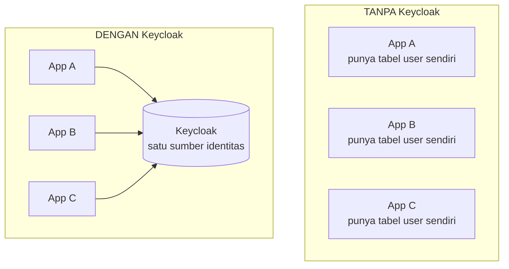
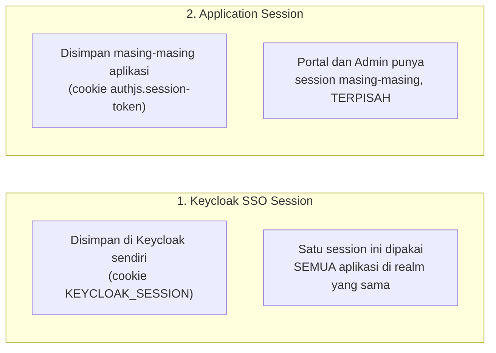
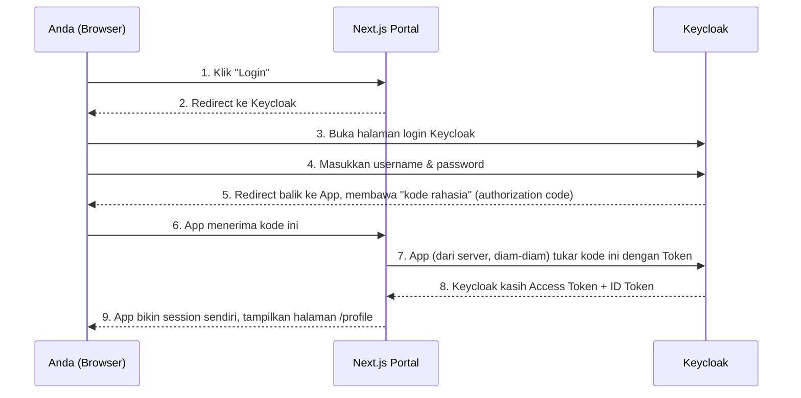
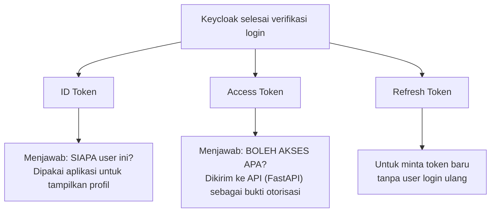

# Panduan Teknis Keycloak — Memahami Konsep dari Nol

Dokumen ini menjelaskan **konsep Keycloak** secara mendalam, menggunakan setup nyata yang sudah kita bangun (realm `demo-sso`, client `nextjs-portal`/`nextjs-admin`, user `demo.user`) sebagai contoh konkret — bukan teori abstrak.

Jika Anda baru pertama kali mengenal Keycloak, baca dokumen ini secara berurutan dari atas ke bawah.

---

## 1. Apa itu Keycloak, sebenarnya?

Bayangkan Anda punya 10 aplikasi berbeda (Portal, Admin, aplikasi HR, aplikasi Finance, dst). Tanpa Keycloak, **setiap aplikasi harus punya sistem login sendiri**: tabel user sendiri, halaman login sendiri, logika "cek password benar atau salah" sendiri, logika reset password sendiri, dst.

Masalahnya:
- User harus daftar & ingat password berbeda di 10 aplikasi.
- Setiap developer aplikasi harus paham cara menyimpan password dengan aman (hashing, salting, dll) — dan sering salah.
- Kalau mau tambah fitur "Login pakai Google", harus diimplementasi ulang di 10 aplikasi.

**Keycloak menyelesaikan ini dengan menjadi satu "kantor pusat identitas"** — semua 10 aplikasi itu **mendelegasikan** urusan login ke Keycloak. Aplikasi tidak lagi menyimpan password siapa pun; mereka hanya percaya pada "surat keterangan" (token) yang diterbitkan Keycloak setelah user berhasil login di sana.

Istilah resminya: Keycloak adalah **Identity and Access Management (IAM)** software, berperan sebagai **Identity Provider (IdP)**.

---

## 2. Empat Konsep Inti yang Wajib Dipahami

Ini adalah empat "benda" utama di dalam Keycloak. Kalau empat ini sudah paham, 80% Keycloak sudah dikuasai.

### 2.1 Realm

**Realm = "dunia" atau "tenant" yang terisolasi.**

Satu server Keycloak bisa punya banyak realm, dan masing-masing realm punya user, client, dan pengaturan sendiri yang **sama sekali tidak saling terlihat**. User di realm A tidak bisa login ke aplikasi di realm B, meskipun mereka ada di server Keycloak yang sama.

Di demo kita:
- `master` — realm bawaan, khusus untuk **mengelola Keycloak itu sendiri** (Anda login sebagai `admin` ke sini untuk membuka Admin Console).
- `demo-sso` — realm yang kita buat sendiri, khusus untuk aplikasi demo kita.

**Analogi:** realm itu seperti "perusahaan" yang berbeda. Karyawan PT A tidak otomatis punya akses ke sistem PT B, meskipun keduanya pakai vendor software HR yang sama.

⚠️ **Aturan penting yang kita pegang teguh sepanjang demo:** jangan pernah mencampur user/client aplikasi ke realm `master` — itu murni untuk administrasi Keycloak.

### 2.2 Client

**Client = satu aplikasi yang diizinkan "bertanya" ke Keycloak: "tolong autentikasi user saya."**

Setiap aplikasi yang mau pakai Keycloak untuk login harus didaftarkan sebagai client. Di demo kita ada dua client di realm `demo-sso`:
- `nextjs-portal` — mewakili aplikasi Portal (`:3088`)
- `nextjs-admin` — mewakili aplikasi Admin (`:3089`)

Setiap client punya:
| Atribut | Fungsi | Contoh di demo kita |
|---|---|---|
| **Client ID** | Nama unik untuk identifikasi aplikasi | `nextjs-portal` |
| **Client Secret** | "Password" khusus aplikasi (bukan punya user) — dipakai server aplikasi untuk membuktikan dirinya benar-benar Portal, bukan aplikasi jahat yang menyamar | disimpan di `.env.local`, tak pernah ditampilkan |
| **Redirect URI** | Daftar putih (whitelist) URL yang boleh dituju setelah login berhasil | `http://localhost:3088/api/auth/callback/keycloak` |
| **Public vs Confidential** | Apakah client bisa menyimpan secret dengan aman (confidential, ada backend) atau tidak (public, misal SPA murni) | Kita pakai **confidential** karena Next.js punya server |

**Analogi:** client itu seperti "badge akses" yang diberikan ke setiap gedung kantor (aplikasi) di kompleks perusahaan yang sama. Gedung Portal punya badge sendiri, gedung Admin punya badge sendiri — tapi keduanya diterbitkan oleh satu pusat keamanan (Keycloak) yang sama.

### 2.3 User

**User = orang yang login.**

Di demo kita, hanya ada satu user: `demo.user`, hidup di realm `demo-sso`. User ini bisa dipakai untuk login ke **kedua** aplikasi (Portal & Admin) karena keduanya berada di realm yang sama — inilah dasar dari SSO.

User punya atribut seperti username, email, nama, dan **credential** (password, yang disimpan ter-hash, bukan plain text, di database Keycloak).

### 2.4 Session

**Session = bukti bahwa user "sedang login" di suatu titik waktu.**

Ini bagian yang sering membingungkan, karena ada **dua jenis session yang berbeda** dan sering tertukar:

- **Keycloak SSO Session** — dibuat saat Anda login di halaman Keycloak. Inilah yang membuat SSO bekerja: begitu session ini ada, aplikasi lain di realm yang sama bisa "numpang" tanpa Anda login ulang.
- **Application Session** — dibuat masing-masing aplikasi (Portal, Admin) setelah mereka menerima token dari Keycloak. Ini independen — logout dari Portal **tidak** menghapus session Admin, dan tidak menghapus session SSO di Keycloak (sudah kita buktikan langsung di [Phase 16](phase-16-logout.md)).

**Ini penyebab utama kebingungan pemula**: mengira "logout dari satu aplikasi = logout total". Padahal tidak — logout total hanya terjadi kalau Anda logout dari Keycloak-nya sendiri.

---

## 3. Bagaimana Keycloak "Berbicara" dengan Aplikasi (OIDC/OAuth2)

Keycloak menggunakan **protokol standar industri**, bukan protokol buatan sendiri. ada dua istilah yang sering tertukar:

| | OAuth 2.0 | OpenID Connect (OIDC) |
|---|---|---|
| Fungsi | Memberi **izin akses** (authorization) | Memberi **identitas** (authentication), dibangun **di atas** OAuth 2.0 |
| Menjawab pertanyaan | "Boleh nggak aplikasi ini akses data X?" | "Siapa sebenarnya user ini?" |
| Keycloak berperan sebagai | Authorization Server | Identity Provider |

**Kenapa ini penting dipahami:** Keycloak sebenarnya "berbicara" OAuth 2.0 di level teknis (protokol pertukaran code/token), tapi ditambahkan lapisan OIDC di atasnya supaya bisa menjawab "siapa user ini", bukan cuma "boleh akses apa". Makanya di setiap request kita selalu menyertakan `scope=openid ...` — kata `openid` inilah yang mengaktifkan lapisan identitas tadi. Kita bahkan pernah membuktikan langsung: saat lupa menyertakan `openid` di scope (Phase 11), token yang dihasilkan kehilangan informasi identitas standar.

### Alur Login (Authorization Code Flow) — Langkah demi Langkah

Ini alur yang kita pakai di Portal & Admin. Diagram ini persis menggambarkan apa yang terjadi saat Anda klik "Login":

**Poin paling penting untuk dipahami:** password Anda **hanya pernah diketik satu kali, di halaman Keycloak** (langkah 4). Next.js Portal **tidak pernah melihat password Anda sama sekali**. Ini alasan utama Keycloak dianggap lebih aman dibanding aplikasi bikin form login sendiri.

### Kenapa harus "tukar kode dulu" (langkah 7), tidak langsung dikasih token di langkah 5?

Karena langkah 5 lewat **browser** (bisa dilihat orang lain lewat URL history, network log, dll — disebut *front-channel*), sedangkan langkah 7 terjadi **langsung dari server ke server** (tidak lewat browser sama sekali — disebut *back-channel*, jauh lebih sulit disadap).

Jadi kode di langkah 5 itu **tidak berbahaya kalau bocor**, karena kode itu sendiri tidak berguna — harus ditukar lagi memakai `client_secret` (yang cuma dipegang server Portal) untuk benar-benar jadi token. Ini seperti nomor antrian di bank: nomor antrian saja tidak bisa dipakai ambil uang, harus ditunjukkan ke teller (server) yang tahu prosedur lengkapnya.

---

## 4. Tiga Jenis "Surat Keterangan" (Token) yang Diterbitkan Keycloak

Setelah login berhasil, Keycloak memberi **tiga token sekaligus**, masing-masing punya fungsi berbeda:

| Token | Isi | Siapa yang pakai | Contoh di demo kita |
|---|---|---|---|
| **ID Token** | Info identitas: nama, email, username | Aplikasi (Next.js), untuk render halaman `/profile` | Tidak pernah dikirim ke API |
| **Access Token** | Bukti otorisasi, biasanya klaim minim | Dikirim ke API sebagai header `Authorization: Bearer ...` | Dikirim Portal → FastAPI |
| **Refresh Token** | "Kupon" untuk menukar dapat Access Token baru | Dipegang server aplikasi, dipakai diam-diam saat token lama kedaluwarsa | Tidak aktif dipakai di demo kita (token cuma hidup 5 menit, lalu login ulang) |

Ketiganya berbentuk **JWT** (JSON Web Token) — format string yang bisa "dibuka" (didekode) siapa saja untuk dibaca isinya, tapi **tidak bisa dipalsukan** karena ada tanda tangan digital dari Keycloak. Detail lengkap format JWT ada di [Phase 10](phase-10-jwt.md).

⚠️ **Penemuan penting dari demo kita**: secara default, Keycloak versi terbaru (26) membuat Access Token **minim informasi** (disebut *lightweight access token*) — tidak ada nama/email di dalamnya, hanya info teknis. Kita harus mengubah setelan client secara eksplisit (`access.token.lightweight.disabled=true`) supaya FastAPI bisa langsung baca nama/email dari Access Token tanpa panggilan tambahan. Detail lengkap: [Phase 11](phase-11-fastapi.md).

---

## 5. Tur Singkat Admin Console

Buka **http://localhost:8088/admin**, login `admin`/`admin123`. Berikut menu-menu yang relevan dengan setup kita:

| Menu | Fungsi | Contoh isi di realm `demo-sso` kita |
|---|---|---|
| **Realm selector** (pojok kiri atas) | Pindah antar realm | Pastikan sedang memilih `demo-sso`, bukan `master`, saat mengecek konfigurasi demo |
| **Clients** | Daftar aplikasi terdaftar | `nextjs-portal`, `nextjs-admin` |
| **Users** | Daftar user | `demo.user` |
| **Sessions** | Melihat siapa saja yang sedang login (SSO session aktif) | Coba buka ini setelah login di Portal — Anda akan lihat satu session aktif dipakai oleh dua client sekaligus! |
| **Realm settings** | Pengaturan umum realm (token lifespan, dll) | Kita sempat ubah `Access Token Lifespan` jadi 5 detik untuk testing di [Phase 12](phase-12-nextjs-fastapi-integration.md) |
| **Client scopes** | Kelompok klaim yang bisa diminta aplikasi | `profile`, `email`, dll — menentukan info apa yang masuk token |

**Coba ini sendiri:** setelah login SSO ke Portal & Admin (seperti demo di [DEMO-GUIDE.md](DEMO-GUIDE.md)), buka menu **Sessions** di Admin Console. Anda akan melihat **satu baris session**, tapi kolom "Clients" menunjukkan **dua client** (`nextjs-portal` dan `nextjs-admin`) memakai session yang sama. Ini adalah bukti visual paling jelas dari SSO.

---

## 6. Ringkasan Istilah (Glossary Cepat)

| Istilah | Arti singkat |
|---|---|
| **Realm** | Ruang identitas terisolasi (kita pakai `demo-sso`) |
| **Client** | Aplikasi yang terdaftar boleh pakai Keycloak (`nextjs-portal`, `nextjs-admin`) |
| **User** | Orang yang login (`demo.user`) |
| **IdP (Identity Provider)** | Peran Keycloak — pihak yang menerbitkan bukti identitas |
| **SSO (Single Sign-On)** | Satu login, banyak aplikasi — dimungkinkan karena Keycloak Session dipakai bersama |
| **OAuth 2.0** | Protokol dasar untuk otorisasi (izin akses) |
| **OIDC** | Lapisan identitas di atas OAuth 2.0 |
| **Authorization Code Flow** | Alur login standar yang kita pakai — aman karena token ditukar lewat server, bukan browser |
| **PKCE** | Lapisan keamanan tambahan pada Authorization Code Flow |
| **ID Token** | Token berisi identitas user |
| **Access Token** | Token untuk otorisasi akses API |
| **Refresh Token** | Token untuk perpanjang sesi tanpa login ulang |
| **JWT** | Format token yang dipakai (`HEADER.PAYLOAD.SIGNATURE`) |
| **Client Secret** | "Password" milik aplikasi (bukan user), untuk membuktikan aplikasi itu asli |
| **Redirect URI** | Whitelist URL tujuan setelah login |
| **Keycloak SSO Session** | Session di level Keycloak — dipakai bersama semua aplikasi |
| **Application Session** | Session di level masing-masing aplikasi — independen per aplikasi |

---

## 7. Kalau Masih Bingung — Analogi Penuh

Bayangkan Keycloak seperti **sistem keamanan satu gedung perkantoran besar** (mal kantor) dengan banyak tenant (perusahaan berbeda):

- **Realm** = mal itu sendiri (misalnya "Mal Perkantoran Sudirman")
- **Client** = tiap perusahaan penyewa lantai (Portal Inc., Admin Corp.)
- **User** = karyawan yang bekerja dan boleh masuk ke lantai-lantai itu
- **Login di Keycloak** = check-in di resepsionis utama mal, menunjukkan KTP
- **ID Card yang diberi resepsionis** = ID Token (bukti siapa Anda)
- **Access badge yang bisa dipakai buka pintu lantai tertentu** = Access Token
- **SSO Session** = "gelang tangan" dari resepsionis utama yang berlaku selama Anda di dalam mal — begitu ada gelang ini, Anda bisa masuk ke perusahaan manapun di mal itu tanpa check-in ulang di resepsionis masing-masing
- **Logout dari satu perusahaan** = Anda keluar dari kantor perusahaan A, tapi gelang tangan Anda masih aktif — begitu masuk kantor B, mereka scan gelang Anda dan langsung mengenali Anda
- **Logout total dari resepsionis mal (Keycloak)** = gelang dilepas — sekarang harus check-in ulang di manapun Anda mau masuk

---

## Bacaan Lanjutan

- [Phase 5 — Create Realm](phase-05-create-realm.md) — realm secara detail
- [Phase 7 — Client nextjs-portal](phase-07-client-nextjs-portal.md) — konfigurasi client lengkap
- [Phase 9 — Understanding OIDC Flow](phase-09-oidc-flow.md) — alur OIDC dengan data nyata
- [Phase 10 — JWT](phase-10-jwt.md) — struktur token secara detail
- [Phase 15 — SSO Demonstration](phase-15-sso-demonstration.md) — bukti SSO dengan HTTP nyata
- [Phase 16 — Logout](phase-16-logout.md) — perbedaan Application Session vs Keycloak SSO Session
- [DEMO-GUIDE.md](DEMO-GUIDE.md) — panduan coba langsung di browser
