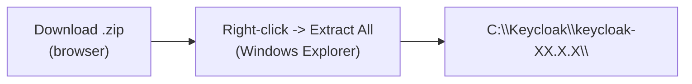
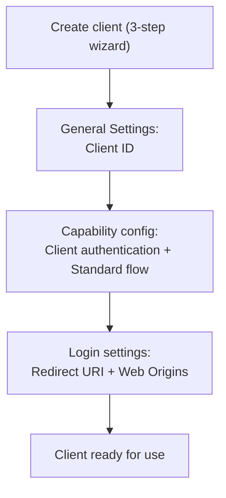

# Keycloak Installation & Implementation Guide (Windows, GUI-First)

This guide is purely about **Keycloak itself** — how to install it, deploy it, do the initial setup (realm/user/client), maintain it, monitor it, and troubleshoot it — until Keycloak is ready to be used by any application. It does not cover any specific application.

**Principles of this guide:**
- Use the **GUI / clicks in Windows Explorer / the browser-based Admin Console** wherever possible
- The terminal is used **only** when it is genuinely the only way — and every time that happens, it is clearly flagged ⚠️ **REQUIRES TERMINAL**
- When the terminal is unavoidable, use a **plain Command Prompt (CMD)** — not PowerShell

---

## Table of Contents

1. [Prerequisites](#1-prerequisites)
2. [Installation](#2-installation)
3. [Deploy — Running Keycloak](#3-deploy--running-keycloak)
4. [Implementation — Initial Setup via Admin Console](#4-implementation--initial-setup-via-admin-console)
5. [Connecting an Application to Keycloak](#5-connecting-an-application-to-keycloak)
6. [Maintenance](#6-maintenance)
7. [Monitoring](#7-monitoring)
8. [Troubleshooting](#8-troubleshooting)

---

## 1. Prerequisites

| Requirement | How to Check (GUI) |
|---|---|
| Windows 10/11 64-bit | Settings → System → About |
| Java 17, 21, or 25 (LTS) | See step 2.1 below |
| (Optional) External database — PostgreSQL/MySQL/Oracle | If not set up, Keycloak still runs fine on its built-in database (H2) for demos/testing |

---

## 2. Installation

### 2.1 Check/Install Java (GUI)

1. Open **Settings** → search **"Installed apps"** (or via Control Panel → Programs) to check whether "Java" or "OpenJDK" is already installed.
2. If not, download the Java 21 LTS installer from your browser:
   - Go to `https://adoptium.net` (or your preferred JDK vendor's official site)
   - Choose **Version: 21 (LTS)**, **OS: Windows**, **Architecture: x64**, format **.msi**
   - Click **Download**
3. Once the `.msi` file has downloaded, **double-click** the installer in File Explorer.
4. Follow the install wizard (Next → Next → Install) — make sure the **"Set JAVA_HOME variable"** option is checked if the installer offers it (most modern installers do).
5. Click **Finish**.

### 2.2 Set JAVA_HOME Manually via GUI (if the installer didn't set it automatically)

1. Press the **Windows** key, type **"environment variables"**, choose **"Edit the system environment variables"**.
2. In the **System Properties** window that opens, click **"Environment Variables..."**.
3. Under **"User variables"**, click **"New..."**.
4. Fill in:
   - **Variable name:** `JAVA_HOME`
   - **Variable value:** the folder where Java is installed, e.g. `C:\Program Files\Java\jdk-21`
5. Click **OK** on every window to save.

> 💡 **Finding your Java folder:** open File Explorer → go to `C:\Program Files\Java\` → check the folder name inside it (usually `jdk-21` or similar).

### 2.3 Download Keycloak (Browser)

1. Open your browser and visit the official page: `https://www.keycloak.org/downloads`
2. Find the **latest stable release** and click the **"Distribution powered by Quarkus"** link — this downloads a `.zip` file (e.g. `keycloak-26.7.3.zip`).
3. The file is saved to your **Downloads** folder.

### 2.4 Extract Keycloak (Windows Explorer, No Terminal)

1. First create a destination folder, e.g. `C:\Keycloak` — open File Explorer, go to `C:\`, right-click an empty area → **New → Folder** → name it `Keycloak`.
2. Open the **Downloads** folder and locate the `keycloak-XX.X.X.zip` file you downloaded.
3. **Right-click** the file → choose **"Extract All..."**.
4. In the dialog that appears, click **"Browse..."**, select the `C:\Keycloak` folder you just created, click **Select Folder**.
5. Click **Extract**.

Result: `C:\Keycloak\keycloak-XX.X.X\` contains the `bin`, `conf`, `lib`, `providers`, and `themes` folders.



---

## 3. Deploy — Running Keycloak

### 3.1 ⚠️ REQUIRES TERMINAL — Why There Is No Pure-GUI Option

Keycloak is an application *server* (like a web server), not a program with an ordinary desktop icon — the only way to run it is to run the **`kc.bat`** file located in the `bin` folder. This file **must** be run through a command-line window because:
- It needs to read configuration arguments (port, mode, etc.)
- It needs to stream the startup process logs live

**The good news:** you don't need to type a long command every time — **double-click the `.bat` file** once it's created (see 3.3), and after that a click is all it takes, no typing required.

### 3.2 The Simplest Way — Direct Double-Click

1. Open File Explorer, go to `C:\Keycloak\keycloak-XX.X.X\bin`
2. **Double-click** the **`kc.bat`** file
3. A black Command Prompt window will open showing the startup process — **leave it open**, that's the sign Keycloak is running
4. Wait for a line like:
   ```
   Keycloak ... started in XX.Xs. Listening on: http://localhost:8080
   ```

With this approach, Keycloak runs on the default port `8080`, in development mode, on the built-in database (H2 — data is lost on every restart, fine for quick testing).

### 3.3 A Tidier Way — Create Your Own `.bat` File (Still No Command Typing)

To set a custom port, admin user, and database, create your own `.bat` file **once** — after that, just double-click it every time:

1. Open **Notepad** (Windows' built-in GUI app)
2. Type the following content:
   ```bat
   @echo off
   cd /d C:\Keycloak\keycloak-XX.X.X\bin
   set KC_BOOTSTRAP_ADMIN_USERNAME=admin
   set KC_BOOTSTRAP_ADMIN_PASSWORD=admin123
   kc.bat start-dev --http-port=8080
   pause
   ```
   *(Replace `keycloak-XX.X.X` with your version folder name, and adjust the port/password as needed.)*
3. Click **File → Save As**
4. Choose a location (e.g. Desktop), name it **`Start Keycloak.bat`**, change **"Save as type"** to **"All Files"**, click **Save**
5. From then on, just **double-click** `Start Keycloak.bat` whenever you want to run Keycloak — no typing required.

| Config line | Purpose |
|---|---|
| `KC_BOOTSTRAP_ADMIN_USERNAME` / `PASSWORD` | Initial admin account to sign in to the Admin Console |
| `--http-port=8080` | Port Keycloak listens on (change if it conflicts with another application) |
| `pause` | Keeps the window from closing immediately if there's an error |

### 3.4 Verify Keycloak Is Running (GUI — Browser)

Open your browser and visit:
```
http://localhost:8080
```
If the Keycloak welcome page appears, the server is running.

### 3.5 Stopping Keycloak

Simply **close the open Command Prompt window** (click the X), or press `Ctrl+C` inside that window and confirm.

---

## 4. Implementation — Initial Setup via Admin Console

Every step in this section is **100% GUI**, done in the browser — no commands at all.

### 4.1 Log In to the Admin Console

1. Open your browser: `http://localhost:8080/admin`
2. Enter the admin username & password (set in step 3.3)
3. Click **Sign In**

### 4.2 Create a New Realm

A realm is a separate "space" for your users & applications — don't use the `master` realm (that's reserved for Keycloak's own administration).

1. In the top-left corner, click the dropdown showing **"Keycloak"** (the current realm's name)
2. Click **"Create Realm"**
3. Enter a **Realm name**, e.g. `demo-sso`
4. Make sure the **Enabled** toggle is **On**
5. Click **Create**

### 4.3 Create a User

1. Make sure the active realm (top-left dropdown) is the one you just created, not `master`
2. In the left menu, click **Users**
3. Click **Add user**
4. Fill in **Username**, **Email**, **First name**, **Last name**
5. Click **Create**
6. Once the user is created, open the **Credentials** tab on that user's page
7. Click **Set password**
8. Enter a password, turn off the **Temporary** toggle (so the user isn't forced to change their password on first login — adjust to your needs)
9. Click **Save**

### 4.4 Create a Client (Registering an Application)

Any application that wants to use Keycloak for login must be registered as a **client**.

1. In the left menu, click **Clients**
2. Click **Create client**
3. **Step "General Settings":**
   - **Client type:** `OpenID Connect`
   - **Client ID:** a unique name for your application, e.g. `my-app`
   - Click **Next**
4. **Step "Capability config":**
   - **Client authentication:** **On** (if your application has a server/backend that can securely hold a secret) — if the application runs purely in the browser with no server (SPA), choose **Off**
   - **Authentication flow:** check **Standard flow** (used for a regular login form)
   - Click **Next**
5. **Step "Login settings":**
   - **Valid redirect URIs:** enter the exact URL Keycloak is allowed to redirect the browser back to after a successful login, e.g. `http://localhost:3000/callback` — **don't use a wildcard (`*`) carelessly**, enter a full, specific URL
   - **Web origins:** enter your application's origin, e.g. `http://localhost:3000`
   - Click **Save**



### 4.5 Retrieve the Client Secret (if Client Authentication = On)

1. Still on that client's page, open the **Credentials** tab
2. Look at the **Client Secret** field — click the eye icon 👁️ to reveal it, or the copy icon 📋 to copy it
3. Store this value securely (straight into your application's configuration) — **never write it in documents, chats, or anywhere else easily visible to others**

---

## 5. Connecting an Application to Keycloak

Once the realm, user, and client are ready, your application needs the following 3–4 pieces of information (all obtainable from the Admin Console, no terminal needed):

| Info | Where to Get It |
|---|---|
| **Issuer / Realm URL** | `http://localhost:8080/realms/<realm-name>` |
| **Client ID** | What you entered in step 4.4 |
| **Client Secret** | From step 4.5 (if Client authentication = On) |
| **Redirect URI** | What you registered in step 4.4 |

How to plug these values into your application differs by framework/language — usually through that application's own configuration file (outside the scope of this guide, since this guide is purely about Keycloak).

To view the technical details of the available endpoints (authorization endpoint, token endpoint, etc.), open:
```
http://localhost:8080/realms/<realm-name>/.well-known/openid-configuration
```
This is a standard OIDC JSON page automatically provided by Keycloak — you can open it directly in a browser.

---

## 6. Maintenance

Every step in this section can be done via the **Admin Console (GUI)**.

### 6.1 Making the Admin Permanent (Removing "Temporary" Status)

If the first login shows a warning like **"You are logged in as a temporary admin user"**:

1. Switch to the **`master`** realm (top-left dropdown)
2. Click **Users** → **Add user**
3. Create a new admin user, set a password (**Credentials** tab)
4. Open the **Role mapping** tab on the new user → **Assign role** → find & select the **`admin`** role
5. Log out of the old bootstrap admin account, log in with the new admin
6. (Optional) Delete the old bootstrap admin account from the **Users** page

### 6.2 Rotating the Client Secret

1. **Clients** → select the client whose secret you want to change
2. **Credentials** tab → click **Regenerate**
3. Copy the new secret and update it in the application's configuration that uses it

### 6.3 Temporarily Disabling a Realm/Client

- **Realm Settings** → toggle **Enabled** = Off (disables the entire realm)
- **Clients** → select a client → toggle **Enabled** = Off (disables just that one application)

### 6.4 Export Realm (Configuration Backup)

1. **Realm Settings** → scroll down to find the **Action** section (or the three-dot menu at the top of the realm page)
2. Choose **Export**
3. Check the options you want (e.g. include groups & roles)
4. Click **Export** — the exported JSON file downloads to your Downloads folder

This file can be used to **Import** the configuration back later (same menu) if you need to restore it.

### 6.5 Database Backup (if Using an External Database)

If Keycloak is configured to use PostgreSQL/MySQL as its database (instead of the built-in H2), back it up using that database's own tooling — e.g. **pgAdmin** (PostgreSQL's official GUI): right-click the database name → **Backup...** → choose a file location → **Backup**.

---

## 7. Monitoring

### 7.1 Seeing Who Is Currently Logged In (Sessions)

1. Select the realm you want to monitor
2. Left menu → **Sessions**
3. Here you can see all active sessions — **a single session row used by more than one client** is visual proof that Single Sign-On (SSO) is working: one login, used by multiple applications.

### 7.2 Viewing Activity Logs (Events)

1. **Realm Settings** → **Events** tab → enable **Save events** (if not already on) so events start being recorded
2. Left menu → **Sessions** → **Events** (or a direct **Events** menu if available), to view login, logout, error history, etc.

### 7.3 Confirming the Keycloak Process Is Still Running (GUI, No Commands)

1. Press `Ctrl+Shift+Esc` to open **Task Manager**
2. Look for a process named **"java.exe"** (or **"Java(TM) Platform SE binary"**) in the list — if present, Keycloak (or another Java process) is running
3. The most reliable check: open a browser to `http://localhost:8080` — if the page loads, Keycloak is alive

### 7.4 Discovery Endpoint (Checking the Active Realm's Configuration)

Open directly in a browser:
```
http://localhost:8080/realms/<realm-name>/.well-known/openid-configuration
```
If this page shows valid JSON, the realm and Keycloak are healthy.

---

## 8. Troubleshooting

### Issue #1 — Not Reachable from Other Computers/Devices on the Network

**Symptom:** Keycloak works fine from its own computer (`localhost:8080`), but other devices on the same network can't connect.

**Cause:** By default, Keycloak only accepts connections from its own machine (`127.0.0.1`), not from the outside network.

**Fix:** ⚠️ **Requires editing the `.bat` file** (step 3.3) — add `--http-host=0.0.0.0` to the `kc.bat` command line:
```bat
kc.bat start-dev --http-port=8080 --http-host=0.0.0.0
```
Save the file and run it again (double-click).

---

### Issue #2 — The Login Page Keeps Reappearing (Login Loop)

**Symptom:** After submitting login, it just returns to the login page again, repeatedly.

**Cause:** Usually the browser is blocking cookies, or the computer's system clock is inaccurate (a freshly issued token is treated as already expired).

**Fix:** Check your browser's cookie settings (don't block all third-party cookies for the Keycloak domain), and make sure Windows' clock & timezone are correct (Settings → Time & Language).

---

### Issue #3 — "Invalid redirect_uri" or "Invalid parameter: redirect uri" Error

**Symptom:** A Keycloak error page appears right after clicking login in the application.

**Cause:** The redirect URL sent by the application doesn't match **exactly** what's registered in **Valid redirect URIs** on the client (step 4.4) — even a single character difference (e.g. a trailing slash present or missing) counts as a mismatch.

**Fix:** Go to **Clients** → select the relevant client → make sure **Valid redirect URIs** matches exactly the URL the application actually uses.

---

### Issue #4 — Token from Keycloak Doesn't Contain the User's Name/Email

**Symptom:** The application receives a token, but claims like name, email, username are empty — even though the user has that data.

**Cause:** Starting with Keycloak version 26, the **Access Token** is minimal by default ("lightweight") — the full information lives in the **ID Token**, not the Access Token.

**Fix:** Go to **Clients** → select the client → **Advanced** tab → find the **Advanced Settings** section (or via the **Keys**/**Settings** tab), look for an option related to **"Always Use Lightweight Access Token"** and turn it Off if your application needs to read claims directly from the Access Token.

---

### Issue #5 — Backend Application Always Rejects the Token (Audience Mismatch)

**Symptom:** The backend validates the token's `aud` (audience) claim, and it always fails to match the Client ID.

**Cause:** Keycloak's default Access Token fills `aud` with `"account"`, **not** the application's Client ID. The actual client identity is in the **`azp`** (authorized party) claim.

**Fix:** Change the validation logic in the backend application to match against `azp` instead of `aud` — this isn't something changed in Keycloak, but in the application code that validates the token.

---

### Issue #6 — 500 Error on Logout

**Symptom:** After clicking logout, a server error page (500) appears from Keycloak.

**Cause:** Usually happens when the application calls Keycloak's logout endpoint incompletely (omitting a parameter Keycloak needs to verify the logout request is valid).

**Fix:** Make sure the application's logout flow follows the official OIDC RP-Initiated Logout flow (including `id_token_hint` and/or `post_logout_redirect_uri` per Keycloak's official documentation) — rather than calling the logout endpoint manually/partially.

---

### Issue #7 — Forgotten Admin Password

**Symptom:** Unable to log in to the Admin Console at all.

**Fix:** ⚠️ **Requires Terminal** — reset it using the `kc.bat` command with a new bootstrap-admin option, run from the `bin` folder:
```bat
kc.bat bootstrap-admin user
```
This command will interactively ask for a new username & password right in the Command Prompt window.

---

### Summary: When Is the Terminal Actually Needed

| Activity | GUI Possible? |
|---|---|
| Download & extract Keycloak | ✅ Fully GUI |
| Set JAVA_HOME | ✅ Fully GUI (System Properties) |
| Create realm/user/client | ✅ Fully GUI (Admin Console) |
| Export/import realm | ✅ Fully GUI (Admin Console) |
| View sessions & logs | ✅ Fully GUI (Admin Console) |
| **Running Keycloak (start)** | ⚠️ A terminal window must appear (but a **double-click on the `.bat` file** is all it takes — no typing) |
| Changing startup flags (`--http-host`, etc.) | ⚠️ Requires editing the `.bat` file (with Notepad, GUI) |
| Resetting a completely forgotten admin password | ⚠️ Requires typing a command in Command Prompt |

## Related Reading

See the other files in this project's `docs/` folder for deeper Keycloak concepts (realm, client, session, OIDC flow) and real implementation examples across frontend/backend/database frameworks.
