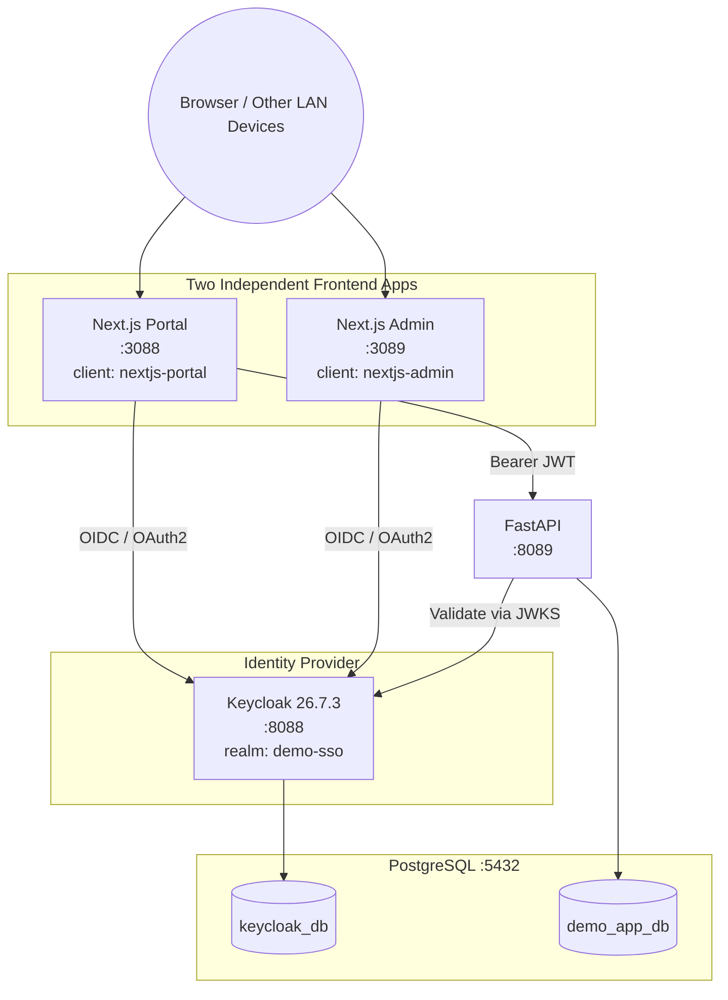
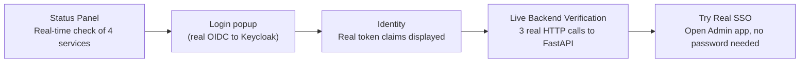
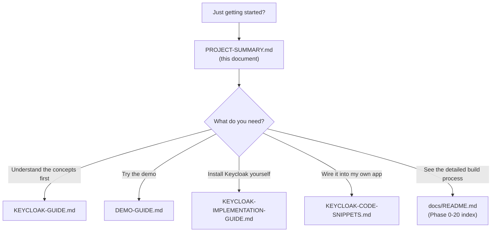

# Project Summary — Keycloak SSO Demo

This document is a **complete, end-to-end summary** of this project — what was built, why, how it's structured, and where to find further detail. Read this when you need the big picture quickly, without opening every other document one by one.

---

## Table of Contents

1. [Executive Summary](#1-executive-summary)
2. [System Architecture](#2-system-architecture)
3. [Components & Technology](#3-components--technology)
4. [Key Features](#4-key-features)
5. [Project Structure](#5-project-structure)
6. [How to Run It](#6-how-to-run-it)
7. [Full Documentation Map](#7-full-documentation-map)
8. [Key Findings & Fixes](#8-key-findings--fixes)
9. [Current Status](#9-current-status)
10. [Limitations & Security Notes](#10-limitations--security-notes)

---

## 1. Executive Summary

This project is a **genuinely working Single Sign-On (SSO) demo**, built from scratch, using **Keycloak** as the Identity Provider on the **OAuth 2.0 / OpenID Connect (OIDC)** standard. Everything runs **natively on Windows — no Docker at all**.

**What's proven with real evidence (not just claimed):**
- One Keycloak, one realm, two independent frontend applications, one shared user — log in once on one application, and you're automatically authenticated on the second without re-entering a password.
- The backend API (FastAPI) validates Keycloak-issued JWTs independently, without calling Keycloak on every single request.
- All of this works both from the server machine itself **and from other devices on the local network (LAN)**.
- There's a **single-page interactive live demo** that runs this entire flow for real (not a recording/simulation) — clickable and testable any time.

**What sets this project apart from a typical tutorial:** every claim in the documentation is backed by **real technical evidence** (actual HTTP responses, actual server logs), and every bug found along the way is **documented as-is** — including design mistakes that were actually made and how they were fixed. This isn't a staged, frictionless scenario — it's a real build process with all its real obstacles.

---

## 2. System Architecture



### Core Design Principles

| Principle | Explanation |
|---|---|
| One Keycloak, many clients | No need for a separate Keycloak per application — just register a new client per app within the same realm |
| One Keycloak database for every application | `keycloak_db` serves every client, regardless of how many applications or platforms are involved |
| Keycloak's database is fully separate from application databases | `keycloak_db` (identity) and `demo_app_db` (business data) never mix |
| The backend only needs to validate tokens, not ask Keycloak on every request | JWT validation via a cached public key (JWKS), not a live call to Keycloak each time |
| The password is typed in exactly one place | Always on Keycloak's own login page — applications never see or store a user's password |

---

## 3. Components & Technology

| Component | Technology | Port | Role |
|---|---|---|---|
| Identity Provider | Keycloak 26.7.3 | 8088 | Authentication, SSO, token issuance |
| Frontend — Portal | Next.js 16 (App Router) + Auth.js v5 | 3088 | Main demo app, hosts the `/flow-demo` page |
| Frontend — Admin | Next.js 16 (App Router) + Auth.js v5 | 3089 | Second application, visual proof of SSO |
| Backend API | FastAPI (Python) | 8089 | JWT validation, business data access |
| Database | PostgreSQL 17 | 5432 | `keycloak_db` + `demo_app_db` (kept separate) |

Every component runs as a native Windows process — managed via the `.bat` scripts in `scripts/`.

---

## 4. Key Features

### 4.1 Live Demo Page — `/flow-demo`

A single interactive page on the Portal (`http://localhost:3088/flow-demo`) that demonstrates the **entire SSO flow for real**, not an animation or simulation:



Characteristics of this page:
- **Never reloads or navigates away** — login and the SSO check happen through popup windows
- Light theme, full-width layout, with a small flow diagram in every sub-section
- Every button triggers a **genuine** HTTP request — the status, response time, and JSON body shown are real results from the actually-running servers

### 4.2 Automated Management Scripts

| Script | Function |
|---|---|
| `scripts\start.bat` | Starts every service, in the background, with no new windows |
| `scripts\stop.bat` | Stops services by the port they're using (precise, doesn't kill unrelated processes) |
| `scripts\status.bat` | Live status check of every service |
| `scripts\restart.bat` | `stop` then `start` |
| `scripts\update-ip.bat` | Auto-detects the current LAN IP and syncs it into every application/Keycloak client config |

### 4.3 LAN Access Support

The entire demo can be reached from **other devices on the same network**, not just the server machine — including an automated mechanism for handling DHCP IP changes.

---

## 5. Project Structure

```text
demo-keycloak/
├── nextjs-portal/          Portal app (client: nextjs-portal)
│   └── src/app/flow-demo/  The main live demo page
├── nextjs-admin/           Admin app (client: nextjs-admin)
├── fastapi-app/            Backend API, validates Keycloak JWTs
├── scripts/                start/stop/status/restart/update-ip scripts (.bat)
├── docs/                   All documentation (see section 7)
└── README.md               Project overview (a shorter version of this document)
```

Keycloak itself is **deliberately installed outside the project folder** (`C:\Keycloak\`), since it's a standalone server, not an application dependency.

---

## 6. How to Run It

```powershell
# 1. Make sure PostgreSQL is running (outside the scope of these scripts)
Get-Service postgresql-x64-17

# 2. Start every application service
cd F:\DataKusnandar\Github\Repository\demo-keycloak
scripts\start.bat

# 3. Confirm everything is ready
scripts\status.bat
```

Open a browser: **http://localhost:3088/flow-demo**

Demo login: `demo.user` / `DemoUser@123`

Full step-by-step walkthrough (including an animated presenter version): see [DEMO-GUIDE.md](DEMO-GUIDE.md) / [DEMO-GUIDE.html](DEMO-GUIDE.html).

---

## 7. Full Documentation Map

This project's documentation is layered — from a step-by-step build log to ready-to-use references for other stacks. Here's the complete map:

### 7.1 Build Log (Phase 0–20)

The full build history from scratch, one phase per document, each with real technical verification evidence:

| Phase | Content |
|---|---|
| [Phase 0](phase-00-environment-audit.md) – [4](phase-04-configure-keycloak-database.md) | Environment audit, Java install, Keycloak install, PostgreSQL setup, migrating Keycloak to PostgreSQL |
| [Phase 5](phase-05-create-realm.md) – [7](phase-07-client-nextjs-portal.md) | Creating the `demo-sso` realm, the `demo.user` user, the `nextjs-portal` client |
| [Phase 8](phase-08-nextjs-portal.md) – [10](phase-10-jwt.md) | Building Next.js Portal, explaining the OIDC flow, explaining JWT |
| [Phase 11](phase-11-fastapi.md) – [13](phase-13-postgresql-application-database.md) | Building FastAPI, Portal↔FastAPI integration, the application database |
| [Phase 14](phase-14-nextjs-admin.md) – [16](phase-16-logout.md) | Building Next.js Admin, **the SSO demonstration**, the logout demonstration |
| [Phase 17](phase-17-troubleshooting.md) – [20](phase-20-final-documentation.md) | Troubleshooting, the end-to-end demo, security review, final summary |

Full index with each phase's status: [docs/README.md](README.md).

### 7.2 Concept & Operational Guides

| Document | Audience | Content |
|---|---|---|
| [KEYCLOAK-GUIDE.md](KEYCLOAK-GUIDE.md) | New to Keycloak | Fundamentals from scratch — realm, client, user, session, with analogies |
| [KEYCLOAK-IMPLEMENTATION-GUIDE.md](KEYCLOAK-IMPLEMENTATION-GUIDE.md) / [.html](KEYCLOAK-IMPLEMENTATION-GUIDE.html) | Installing/operating Keycloak yourself | A **GUI-first** runbook — install, deploy, realm/user/client setup, maintenance, monitoring, troubleshooting, done almost entirely by clicking (terminal only where unavoidable) |
| [KEYCLOAK-MULTI-STACK-FLOW.md](KEYCLOAK-MULTI-STACK-FLOW.md) / [.html](KEYCLOAK-MULTI-STACK-FLOW.html) | Using a different stack | How Keycloak works across various frontend/backend/database combinations (not limited to this project's stack) |
| [KEYCLOAK-CODE-SNIPPETS.md](KEYCLOAK-CODE-SNIPPETS.md) / [.html](KEYCLOAK-CODE-SNIPPETS.html) | Ready to start coding | Real, ready-to-adapt code for 4 backends (TypeScript, Python, Golang, .NET) + 5 frontends (.NET, Laravel, Next.js, React.js, Vue.js) |
| [DEMO-GUIDE.md](DEMO-GUIDE.md) / [.html](DEMO-GUIDE.html) | Presenting the demo | A click-by-click guide to running the demo live for an audience |

### 7.3 Suggested Reading Path



---

## 8. Key Findings & Fixes

Building this project surfaced **many real issues** that no official documentation covers — this is what makes this project more valuable than a purely theoretical tutorial. Here are the most significant ones:

| # | Finding | Impact | Fix (short) |
|---|---|---|---|
| 1 | Keycloak binds to `127.0.0.1` only by default | Completely unreachable from the LAN | Add `--http-host=0.0.0.0` |
| 2 | Keycloak 26 uses a *Lightweight Access Token* by default | Identity claims (name/email) empty at the backend | Disable it via a client attribute |
| 3 | Token `aud` is `"account"`, not the Client ID | Naive audience validation always fails | Validate against `azp`, not `aud` |
| 4 | Two apps' session cookies collide on `localhost` | Logging into App A broke App B's session | Namespace the cookie name per app |
| 5 | A Next.js Server Action redirecting to an external URL | Login failed (`pkceCodeVerifier` error) | Move to client-side `signIn()` |
| 6 | `next.config.ts` blocks cross-origin dev resources | Every button dead when opened from a LAN client | Add `allowedDevOrigins` |
| 7 | `AUTH_URL`/`KEYCLOAK_ISSUER` hardcoded to `localhost` | Callback redirect pointed the wrong way from a LAN client | Switch to the LAN IP, automated via `update-ip.bat` |
| 8 | Hardcoded `localhost` inside a browser-side React component (not server-side) | "Admin: DOWN" status and popup failures from the LAN even though the server was fine | Use `window.location.hostname` instead |
| 9 | Corrupted `.next` build cache from repeated forced restarts | 404 pages even though the code was correct | Delete the `.next` folder, rebuild |
| 10 | Calling one `.bat` file from another without `call` | The script silently stopped mid-run | Always use `call` when invoking another `.bat` |

Full details for each finding (symptom, root cause, how it was reproduced, the fix) live in their respective phase documents and in [phase-17-troubleshooting.md](phase-17-troubleshooting.md).

---

## 9. Current Status

| Item | Status |
|---|---|
| All 20 build phases (Phase 0–20) | ✅ Complete |
| SSO proven to work (log in once, two apps) | ✅ Verified with real HTTP evidence |
| LAN access (not just localhost) | ✅ Working, with automated IP handling |
| Live demo page (`/flow-demo`) | ✅ Complete and tested |
| Management scripts (`start`/`stop`/`status`/`restart`/`update-ip`) | ✅ Pure `.bat`, tested end-to-end |
| Documentation | ✅ Complete — 20 phase documents + 5 concept/operational guides |
| GitHub repository | ✅ Pushed to `github.com/seeomkus/demo-keycloak` |

---

## 10. Limitations & Security Notes

This is a **local/development demo**, not a production setup. Before this is used in a real environment, the following must change:

| Aspect | Current State (Demo) | Required for Production |
|---|---|---|
| Protocol | Plain HTTP | HTTPS across every component |
| Keycloak mode | `start-dev` | Production mode (`start`), hardened |
| Passwords/secrets | Demo values, stored in local `.env` files | A secret manager, rotated regularly |
| PostgreSQL authentication | `trust` for local connections | `scram-sha-256`, network-restricted access |
| Keycloak admin | Temporary bootstrap admin | A permanent admin account + MFA |

Full details: [phase-19-security-review.md](phase-19-security-review.md).

---

## Closing Note

This project proves one thing concretely: **SSO with Keycloak can be built natively on Windows, without Docker**, with two independent frontend applications, one backend API, and one cleanly separated database — all verifiable directly through a browser, not just read about in documentation. Every claim in this project's documents has real technical evidence behind it.

For further questions or the next round of development, start at [docs/README.md](README.md) as the navigation hub.
