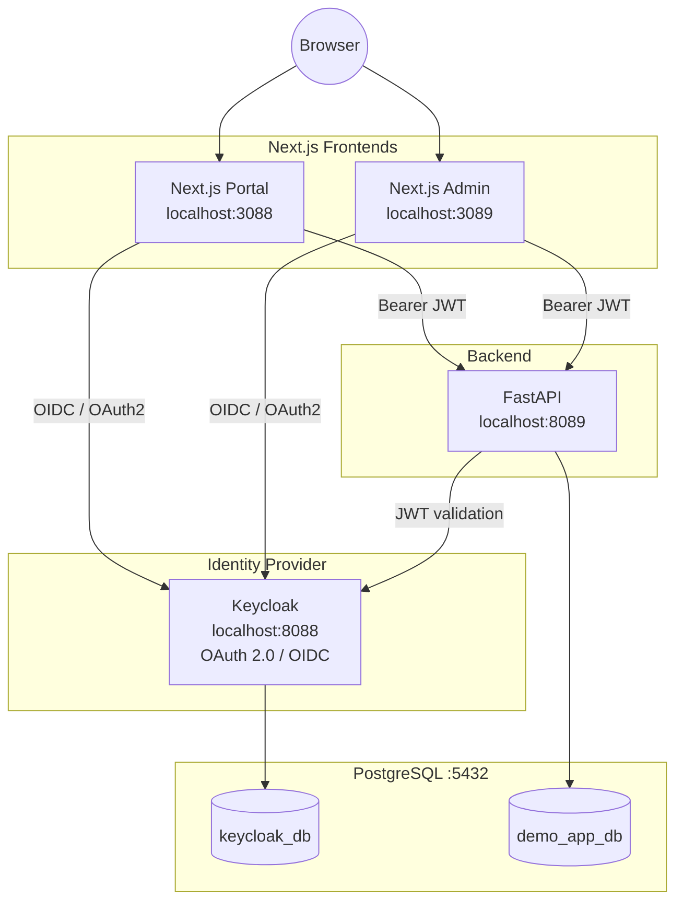

# Demo SSO — Keycloak + Next.js + FastAPI + PostgreSQL

**Documentation Index** — Native Windows deployment (no Docker)

**Status: ✅ All 21 phases (0–20) complete.** See [Phase 20 — Final Documentation](phase-20-final-documentation.md) for the consolidated summary tying every topic back to its implementing phase, or [PROJECT-SUMMARY.md](PROJECT-SUMMARY.md) for a full end-to-end project overview covering everything built through today, including work done after Phase 20 (the live `/flow-demo` page, LAN access, and management scripts).

**Want to run the demo yourself?** → [DEMO-GUIDE.md](DEMO-GUIDE.md) — a click-by-click presenter's guide from starting every service to full teardown. Also available as an animated single-page walkthrough: [DEMO-GUIDE.html](DEMO-GUIDE.html) (Next/Prev step navigation, progress bar, keyboard ← → support — open directly in a browser, works offline).

**New to Keycloak or still confused about the concepts?** → [KEYCLOAK-GUIDE.md](KEYCLOAK-GUIDE.md) *(Bahasa Indonesia)* — a from-scratch conceptual walkthrough (realm, client, user, session, OIDC flow, tokens) grounded in this project's actual setup, with analogies.

**Installing/operating Keycloak itself, independent of this project's apps?** → [KEYCLOAK-IMPLEMENTATION-GUIDE.md](KEYCLOAK-IMPLEMENTATION-GUIDE.md) *(also [.html](KEYCLOAK-IMPLEMENTATION-GUIDE.html))* — a Keycloak-only, GUI-first runbook (Admin Console clicks over CLI wherever possible, terminal only where unavoidable and clearly flagged): install, deploy, realm/user/client setup, maintenance, monitoring, and troubleshooting.

**Wiring up a specific backend/frontend to Keycloak?** → [KEYCLOAK-CODE-SNIPPETS.md](KEYCLOAK-CODE-SNIPPETS.md) *(also [.html](KEYCLOAK-CODE-SNIPPETS.html))* — real, ready-to-adapt code for 4 backends (TypeScript/Express, Python/FastAPI, Golang, .NET Web API) and 5 frontends (.NET MVC, Laravel, Next.js, React.js, Vue.js).

**Planning a different tech stack?** → [KEYCLOAK-MULTI-STACK-FLOW.md](KEYCLOAK-MULTI-STACK-FLOW.md) *(English; also available as [KEYCLOAK-MULTI-STACK-FLOW.html](KEYCLOAK-MULTI-STACK-FLOW.html))* — a stack-agnostic reference covering Keycloak integration across multiple frontends (Next.js, Laravel, .NET, Vue.js, Flutter, plain HTML/JS), backends (.NET, Laravel, Python, NestJS, TypeScript, Golang), and databases (Oracle, PostgreSQL, MySQL), with Mermaid diagrams and comparison tables.

This documentation was generated incrementally, phase by phase, from an original master prompt. Each phase was documented only after it was successfully completed and verified.

## Target Architecture

## Baseline Configuration

| Component | URL / Port |
|---|---|
| Keycloak | http://localhost:8088 |
| Next.js Portal | http://localhost:3088 |
| Next.js Admin | http://localhost:3089 |
| FastAPI | http://localhost:8089 |
| PostgreSQL | localhost:5432 |
| Realm | `demo-sso` |
| Client 1 | `nextjs-portal` |
| Client 2 | `nextjs-admin` |
| User | `demo.user` |
| PostgreSQL databases | `keycloak_db`, `demo_app_db` |

## Phase Progress

| Phase | Title | Status |
|---|---|---|
| 0 | [Environment Audit](phase-00-environment-audit.md) | ✅ Completed |
| 1 | [Java](phase-01-java.md) | ✅ Completed |
| 2 | [Install Keycloak](phase-02-install-keycloak.md) | ✅ Completed |
| 3 | [PostgreSQL](phase-03-postgresql.md) | ✅ Completed |
| 4 | [Configure Keycloak Database](phase-04-configure-keycloak-database.md) | ✅ Completed |
| 5 | [Create Realm (`demo-sso`)](phase-05-create-realm.md) | ✅ Completed |
| 6 | [Create User (`demo.user`)](phase-06-create-user.md) | ✅ Completed |
| 7 | [Client `nextjs-portal`](phase-07-client-nextjs-portal.md) | ✅ Completed |
| 8 | [Next.js Portal](phase-08-nextjs-portal.md) | ✅ Completed |
| 9 | [Understanding OIDC Flow](phase-09-oidc-flow.md) | ✅ Completed |
| 10 | [JWT](phase-10-jwt.md) | ✅ Completed |
| 11 | [FastAPI](phase-11-fastapi.md) | ✅ Completed |
| 12 | [Next.js → FastAPI Integration](phase-12-nextjs-fastapi-integration.md) | ✅ Completed |
| 13 | [PostgreSQL Application Database](phase-13-postgresql-application-database.md) | ✅ Completed |
| 14 | [Next.js Admin](phase-14-nextjs-admin.md) | ✅ Completed |
| 15 | [SSO Demonstration](phase-15-sso-demonstration.md) | ✅ Completed |
| 16 | [Logout](phase-16-logout.md) | ✅ Completed |
| 17 | [Troubleshooting](phase-17-troubleshooting.md) | ✅ Completed |
| 18 | [End-to-End Demo](phase-18-end-to-end-demo.md) | ✅ Completed |
| 19 | [Security Review](phase-19-security-review.md) | ✅ Completed |
| 20 | [Final Documentation](phase-20-final-documentation.md) | ✅ Completed |

## Mandatory Rules Followed Throughout

- **No Docker** — every component runs natively on Windows.
- Every phase stops for confirmation before the next begins.
- No real passwords, client secrets, or active tokens are ever requested from the user — only demo values.
- Secrets are supplied via **environment variables**, never hardcoded in source or config files committed to the repo.
- One Keycloak instance, one realm (`demo-sso`), two clients (`nextjs-portal`, `nextjs-admin`), one user (`demo.user`).
- Keycloak's database is kept logically separate from the application's database.
