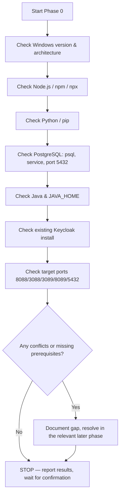

# Phase 0 — Environment Audit

**Status:** ✅ Completed
**Date:** 2026-09-01

## Objective

Audit the local Windows environment before installing any software, to confirm prerequisites and detect port conflicts ahead of time. No installation was performed in this phase.

## Method

All checks were performed using PowerShell, following the official Keycloak, Node.js, Python, and PostgreSQL documentation as reference for required tooling. This phase is strictly read-only: nothing is installed, modified, or configured — only inspected.



## Checks Performed

### 1. Windows Version & Architecture

```powershell
[System.Environment]::OSVersion.Version
Get-ComputerInfo -Property OsName, OsArchitecture, WindowsVersion
```

| Item | Result |
|---|---|
| OS | Windows 11 Pro |
| Architecture | 64-bit |
| Build | 26100 |

### 2. Node.js / npm / npx

```powershell
node -v
npm -v
npx -v
```

| Tool | Version |
|---|---|
| Node.js | v22.18.0 |
| npm | 11.12.1 |
| npx | 11.12.1 |

### 3. Python / pip

```powershell
python --version
pip --version
```

| Tool | Version |
|---|---|
| Python | 3.13.5 |
| pip | 26.1.2 (`D:\Python\Python313`) |

### 4. PostgreSQL

```powershell
psql --version
Get-Service -Name "postgresql*"
Get-NetTCPConnection -LocalPort 5432
```

| Item | Result |
|---|---|
| psql version | 17.5 |
| Service | `postgresql-x64-17` — Running |
| Port 5432 | In use by process `postgres` (expected — the service listens here) |
| Install location | `D:\PostgreSQL\17` |

### 5. Java

```powershell
java -version
$env:JAVA_HOME
```

| Item | Result |
|---|---|
| Java version | 21.0.9 LTS (Oracle JDK, HotSpot 64-bit) |
| JAVA_HOME | Not set (addressed in Phase 1) |

### 6. Keycloak

Checked for any existing installation (`kc.bat`, `KEYCLOAK_HOME`, common install directories).

**Result:** Not installed — proceeds to Phase 2.

### 7. Target Ports

| Port | Component | Status |
|---|---|---|
| 8088 | Keycloak | FREE |
| 3088 | Next.js Portal | FREE |
| 3089 | Next.js Admin | FREE |
| 8089 | FastAPI | FREE |
| 5432 | PostgreSQL | IN USE (expected — PostgreSQL service) |

## Why This Phase Matters

Skipping an environment audit is a common source of wasted effort in local SSO demos: installing Keycloak before confirming a compatible Java version, or configuring a port that is already bound by another service, produces confusing errors much later in the process — often during Phase 15 (SSO demonstration) when the root cause is far removed from the symptom. Auditing first, and stopping to report findings before installing anything, keeps every later phase deterministic and easy to debug.

## Conclusions

- No port conflicts with the target architecture.
- Node.js, Python, and PostgreSQL prerequisites are already satisfied.
- Java 21 is installed but `JAVA_HOME` was not configured — handled in [Phase 1](phase-01-java.md).
- Keycloak is not yet installed — handled in [Phase 2](phase-02-install-keycloak.md).
- No software was installed during this phase, per the audit-only rule.

## Checkpoint

✅ Environment audited, no conflicts found, ready to proceed to Phase 1.
