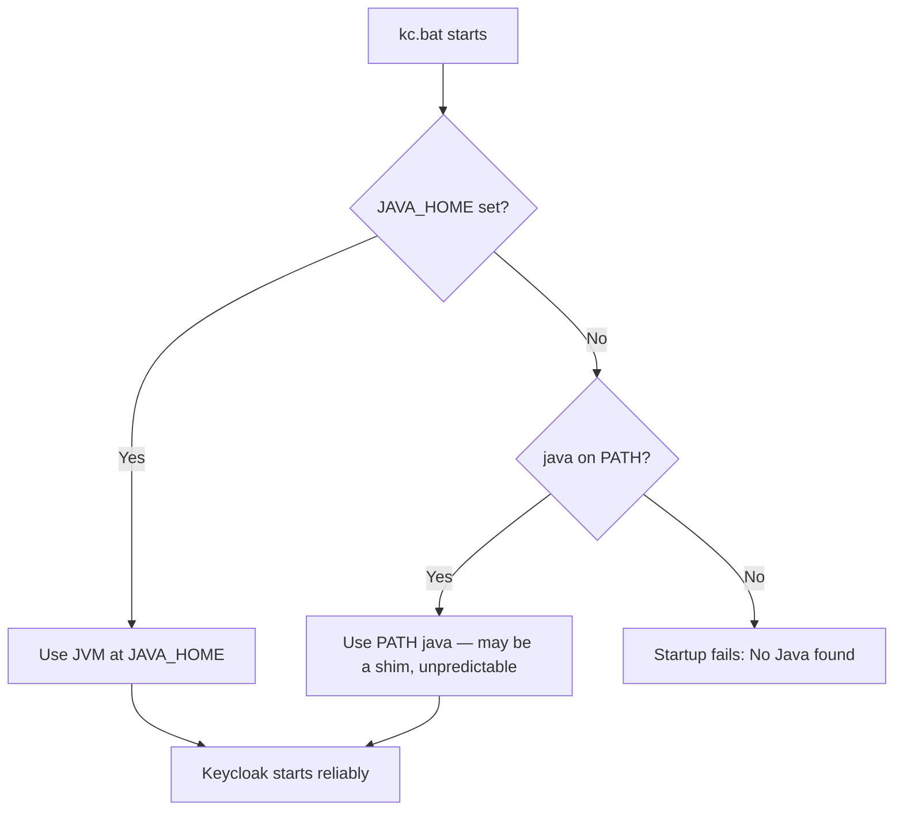

# Phase 1 — Java

**Status:** ✅ Completed
**Date:** 2026-09-01

## Objective

Verify that an existing Java installation is compatible with the target Keycloak version, and configure `JAVA_HOME` if missing. No new Java installation was required.

## Official Reference

Per the official Keycloak documentation ([Supported Configurations](https://www.keycloak.org/server/supported-configurations)):

- Keycloak 26.7.3 (the latest stable version at the time of this demo) supports **OpenJDK 17, 21, and 25 (all LTS releases)**.
- For production, the latest supported JDK (OpenJDK 25) is recommended for the best performance improvements.
- The official Keycloak container image uses OpenJDK 21.

## Why JAVA_HOME Matters

Keycloak's distribution scripts (`kc.bat` / `kc.sh`) are Quarkus-based launchers that need to locate a JVM to run on. They resolve the JVM in this order:



Relying on `PATH` alone is fragile: on this machine, the first `java` found on `PATH` was Oracle's `javapath` shim, a redirector rather than an actual JDK installation directory. Tools that specifically need a JDK *home* directory (not just a `java` binary) fail against a shim. Setting `JAVA_HOME` explicitly removes this ambiguity.

## Compatibility Check

From the Phase 0 audit, Java 21.0.9 LTS (Oracle JDK, HotSpot build) was already installed.

**Conclusion:** ✅ Compatible — Oracle JDK 21 satisfies Keycloak's LTS requirement (17/21/25). No reinstallation needed. Oracle JDK is API-compatible with OpenJDK for Keycloak's purposes; Keycloak does not mandate a specific JDK vendor, only a supported LTS major version.

## JAVA_HOME Configuration

### 1. Locate real JDK installation

The `java` command initially resolved to Oracle's `javapath` shim (`C:\Program Files\Common Files\Oracle\Java\javapath\java.exe`), not the actual JDK home. The real JDK installation was found at:

```text
C:\Program Files\Java\jdk-21
```

### 2. Set JAVA_HOME (User environment variable)

```powershell
[System.Environment]::SetEnvironmentVariable("JAVA_HOME", "C:\Program Files\Java\jdk-21", "User")
```

### 3. Verification

```powershell
Get-ItemProperty -Path "HKCU:\Environment" -Name "JAVA_HOME"
```

Result:

```text
JAVA_HOME : C:\Program Files\Java\jdk-21
```

**Note:** Because `JAVA_HOME` was added mid-session, it only becomes visible in *new* PowerShell/terminal sessions opened after the change — this is expected Windows environment-variable behavior, not an error.

## Checkpoint

✅ Java 21 confirmed compatible with Keycloak 26.7.3. `JAVA_HOME` configured and verified via the Windows registry. Ready to proceed to [Phase 2 — Install Keycloak](phase-02-install-keycloak.md).
