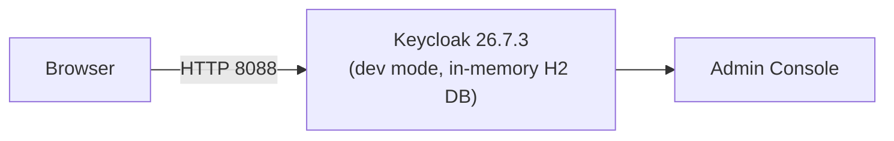

# Phase 2 — Install Keycloak

**Status:** ✅ Completed
**Date:** 2026-09-01

## Objective

Install Keycloak natively on Windows — **no Docker, no containers** — and bring up the Admin Console on the project's dedicated port (`8088`) in development mode.

## Why Native Installation (No Docker)

This demo's explicit constraint is to run every component directly on Windows. The official Keycloak distribution ships as a self-contained ZIP archive (a Quarkus-based server with its own `bin/`, `conf/`, `lib/`, and `providers/` directories), so no container runtime is required — it runs as a plain Java process launched via `kc.bat`.

## Installation Steps

### 1. Identify the Latest Stable Version

Per the official Keycloak downloads page, the latest stable release is **26.7.3**, distributed as a Quarkus-powered ZIP:

```text
https://github.com/keycloak/keycloak/releases/download/26.7.3/keycloak-26.7.3.zip
```

### 2. Download

```powershell
New-Item -ItemType Directory -Force -Path "C:\Keycloak"
Invoke-WebRequest -Uri "https://github.com/keycloak/keycloak/releases/download/26.7.3/keycloak-26.7.3.zip" `
  -OutFile "C:\Keycloak\keycloak-26.7.3.zip"
```

Downloaded file size: **176.7 MB**.

### 3. Extract

```powershell
Expand-Archive -Path "C:\Keycloak\keycloak-26.7.3.zip" -DestinationPath "C:\Keycloak" -Force
Remove-Item "C:\Keycloak\keycloak-26.7.3.zip" -Force
```

Resulting directory structure:

```text
C:\Keycloak\keycloak-26.7.3
├── bin/          ← kc.bat, kc.sh launcher scripts
├── conf/         ← keycloak.conf, certificates
├── lib/          ← Quarkus runtime libraries
├── providers/    ← extension / SPI JARs
├── themes/       ← login page themes
├── LICENSE.txt
├── README.md
└── version.txt
```

### 4. Set KEYCLOAK_HOME

```powershell
[System.Environment]::SetEnvironmentVariable("KEYCLOAK_HOME", "C:\Keycloak\keycloak-26.7.3", "User")
```

### 5. Start in Development Mode

Keycloak was started using its **bootstrap admin** mechanism — admin credentials are supplied via environment variables rather than an interactive prompt, keeping secrets out of shell history and scripts:

```bash
cd C:\Keycloak\keycloak-26.7.3\bin
KC_BOOTSTRAP_ADMIN_USERNAME=admin KC_BOOTSTRAP_ADMIN_PASSWORD=admin123 \
  ./kc.bat start-dev --http-port=8088
```

| Flag / Variable | Purpose |
|---|---|
| `start-dev` | Runs Keycloak in development mode — HTTP allowed, hot reload of some settings, **not for production** |
| `--http-port=8088` | Binds the HTTP listener to the project's dedicated port instead of the default `8080` |
| `KC_BOOTSTRAP_ADMIN_USERNAME` / `KC_BOOTSTRAP_ADMIN_PASSWORD` | Creates a temporary bootstrap admin account on first startup |

### 6. Startup Result

```text
Keycloak 26.7.3 on JVM (powered by Quarkus 3.33.3.1) started in 21.805s.
Listening on: http://localhost:8088
```

### 7. Verification

```powershell
Invoke-WebRequest -Uri "http://localhost:8088" -UseBasicParsing
# => Status: 200
```

The Admin Console was confirmed reachable and login-capable by the user at:

```text
http://localhost:8088/admin/master/console/
```

The user confirmed the Admin Console rendered the `master` realm **Welcome** page, with the sidebar showing *Manage realms*, *Clients*, *Users*, *Sessions*, etc., and a "temporary admin user" security banner (explained below).

## Architecture at This Point



At this stage Keycloak is using its **default embedded H2 database**, not PostgreSQL — meaning any realm, client, or user created now would be lost on restart. This is intentionally corrected in [Phase 4](phase-04-configure-keycloak-database.md).

## Bootstrap Admin Warning

Upon first login, Keycloak displayed:

> "You are logged in as a temporary admin user. To harden security, create a permanent admin account and delete the temporary one."

This is **expected behavior** when using `KC_BOOTSTRAP_ADMIN_USERNAME` / `KC_BOOTSTRAP_ADMIN_PASSWORD`: Keycloak treats this account as temporary until a permanent admin user is explicitly created in the `master` realm. For this local demo, the temporary bootstrap admin is sufficient and does not block any subsequent phase.

## Credentials Used (Demo Only)

| Item | Value | Note |
|---|---|---|
| Admin username | `admin` | |
| Admin password | `admin123` | **Demo password only** — not suitable for production |

## Checkpoint

✅ Keycloak 26.7.3 installed natively (no Docker), running on `http://localhost:8088` in development mode, Admin Console verified reachable and functional. Ready to proceed to [Phase 3 — PostgreSQL](phase-03-postgresql.md).
