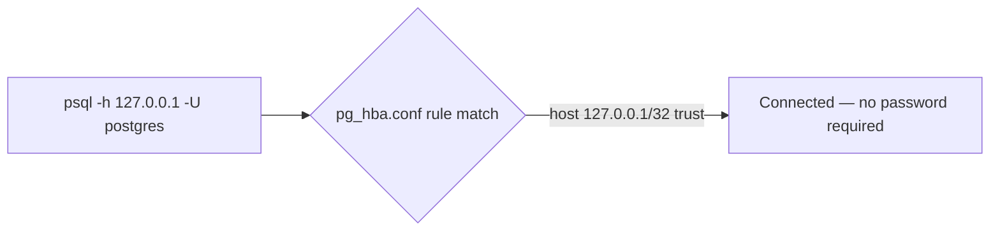
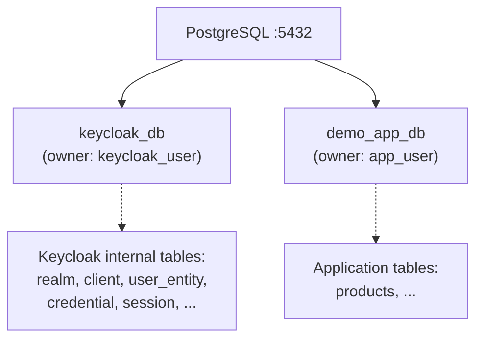

# Phase 3 — PostgreSQL

**Status:** ✅ Completed
**Date:** 2026-09-01

## Objective

Ensure PostgreSQL is running on `localhost:5432`, and create two **logically separated** databases: one for Keycloak's own identity/session data, and one for the demo application's business data. Keycloak's internal tables must never mix with application tables.

## Why Logical Separation Matters

Keycloak is an Identity Provider — it owns its own schema (users, credentials, sessions, clients, realms, tokens metadata, etc.). The demo application (FastAPI + PostgreSQL) owns unrelated business data (e.g. `products`). Mixing them in one database would:

- Create naming collisions and confuse migrations.
- Make it impossible to back up, scale, or secure the IdP independently from the application.
- Blur the architectural boundary the whole demo is meant to teach:

```text
Keycloak
   ≠
Application Database
```

## Existing PostgreSQL Instance

From the Phase 0 audit, PostgreSQL 17.5 was already installed and running as a Windows service:

| Item | Value |
|---|---|
| Service name | `postgresql-x64-17` |
| Install path | `D:\PostgreSQL\17` |
| Port | `5432` |
| Status | Running |

## Authentication Method

The server's `pg_hba.conf` was inspected to determine how to connect:

```text
# TYPE  DATABASE  USER  ADDRESS         METHOD
local   all       all                   scram-sha-256
host    all       all   127.0.0.1/32    trust
host    all       all   ::1/128         trust
```

Connections over TCP from `127.0.0.1` use the **`trust`** method — meaning the `postgres` superuser has no password requirement for local connections. This is a pre-existing setting on this machine (not something configured as part of this demo) and was confirmed by the user. It is acceptable for a local development machine, but **must never be used in production** (see [Phase 19 — Security Review](phase-19-security-review.md)).



## Database Creation

```bash
psql -h 127.0.0.1 -p 5432 -U postgres -c "CREATE DATABASE keycloak_db;"
psql -h 127.0.0.1 -p 5432 -U postgres -c "CREATE DATABASE demo_app_db;"
```

## Dedicated Database Users

Per best practice, the application does not use the `postgres` superuser — each database gets its own owner/user with a demo password (never the real system password):

```bash
CREATE USER keycloak_user WITH ENCRYPTED PASSWORD 'keycloak_demo_pass';
GRANT ALL PRIVILEGES ON DATABASE keycloak_db TO keycloak_user;
ALTER DATABASE keycloak_db OWNER TO keycloak_user;

CREATE USER app_user WITH ENCRYPTED PASSWORD 'app_demo_pass';
GRANT ALL PRIVILEGES ON DATABASE demo_app_db TO app_user;
ALTER DATABASE demo_app_db OWNER TO app_user;
```

## Resulting Layout



## Verification

Each dedicated user was confirmed to connect only to its own database:

```bash
PGPASSWORD=keycloak_demo_pass psql -h 127.0.0.1 -U keycloak_user -d keycloak_db -c "SELECT current_database(), current_user;"
# => keycloak_db | keycloak_user

PGPASSWORD=app_demo_pass psql -h 127.0.0.1 -U app_user -d demo_app_db -c "SELECT current_database(), current_user;"
# => demo_app_db | app_user
```

## Credentials Used (Demo Only)

| Database | Owner User | Password | Note |
|---|---|---|---|
| `keycloak_db` | `keycloak_user` | `keycloak_demo_pass` | Demo password only |
| `demo_app_db` | `app_user` | `app_demo_pass` | Demo password only |

These demo passwords will be supplied to each component via **environment variables**, never hardcoded into source code or configuration committed to version control (see [Phase 4](phase-04-configure-keycloak-database.md) and later phases).

## Checkpoint

✅ PostgreSQL confirmed running, two logically-separated databases created (`keycloak_db`, `demo_app_db`), each with its own dedicated user and verified isolated access. Ready to proceed to [Phase 4 — Configure Keycloak Database](phase-04-configure-keycloak-database.md).
