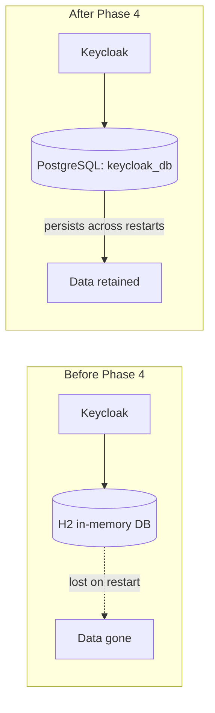
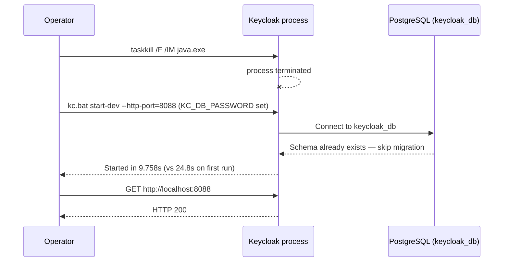

# Phase 4 — Configure Keycloak Database

**Status:** ✅ Completed
**Date:** 2026-09-01

## Objective

Reconfigure Keycloak to persist its data in the dedicated `keycloak_db` PostgreSQL database instead of its default embedded H2 database, and prove — via a real stop/start cycle — that the configuration and data survive a restart.

## Why This Matters

By default, `kc.bat start-dev` uses an **in-memory H2 database**. Every realm, client, and user created against it disappears the moment the process stops. For a demo that spans many phases across possibly multiple sessions, this is unacceptable — Phase 5 onward (Realm, User, Clients) needs durable storage.



## Steps

### 1. Stop the Running Keycloak Process

The Keycloak instance started in Phase 2 (still on H2) was stopped to allow reconfiguration:

```bash
taskkill /F /IM java.exe
```

### 2. Edit `keycloak.conf`

File: `C:\Keycloak\keycloak-26.7.3\conf\keycloak.conf`

```ini
# The database vendor.
db=postgres

# The username of the database user.
db-username=keycloak_user

# The password of the database user.
# NOTE: password is NOT stored here. It is provided via environment
# variable KC_DB_PASSWORD at startup.
#db-password=password

# The full database JDBC URL.
db-url=jdbc:postgresql://localhost:5432/keycloak_db
```

**Security note:** per the demo's mandatory rules ("use environment variables for secrets"), the database **password is intentionally left commented out** of this file. It is supplied only at process-start time via the `KC_DB_PASSWORD` environment variable, keeping the secret out of any file that might be committed to version control.

### 3. Start Keycloak With the DB Password as an Environment Variable

```bash
cd C:\Keycloak\keycloak-26.7.3\bin
KC_DB_PASSWORD=keycloak_demo_pass \
KC_BOOTSTRAP_ADMIN_USERNAME=admin \
KC_BOOTSTRAP_ADMIN_PASSWORD=admin123 \
  ./kc.bat start-dev --http-port=8088
```

### 4. Confirm PostgreSQL Driver Is Active

Startup log evidence, before vs. after:

| | Before (Phase 2) | After (Phase 4) |
|---|---|---|
| Installed features | `..., jdbc-h2, ...` | `..., jdbc-postgresql, ...` |
| Startup time | 21.8s (H2, in-memory) | 24.8s (first run — full schema migration to PostgreSQL) |

### 5. Confirm Schema Was Created in `keycloak_db`

```bash
PGPASSWORD=keycloak_demo_pass psql -h 127.0.0.1 -U keycloak_user -d keycloak_db -c "\dt"
```

Dozens of Keycloak IAM tables were created, including: `realm`, `client`, `user_entity`, `credential`, `admin_event_entity`, `authentication_flow`, `client_scope`, and more.

### 6. Restart Test (Persistence Proof)



The second startup completed in **9.7 seconds** — dramatically faster than the first (24.8s) — because Keycloak detected the schema already present in `keycloak_db` and skipped the full Liquibase migration. This is direct evidence that configuration and data are now persistent.

### 7. Final Verification

```powershell
Invoke-WebRequest -Uri "http://localhost:8088" -UseBasicParsing
# => Status: 200
```

## Checkpoint Summary

| Test | Result |
|---|---|
| Configure `db=postgres`, `db-url`, `db-username` | ✅ |
| Supply DB password via environment variable (not hardcoded) | ✅ |
| Start Keycloak against `keycloak_db` | ✅ (`jdbc-postgresql` active) |
| Admin Console reachable | ✅ HTTP 200 |
| Stop Keycloak | ✅ |
| Restart Keycloak | ✅ Faster startup — schema reused |
| Configuration and schema persisted across restart | ✅ Confirmed |

## Checkpoint

✅ Keycloak now stores all IAM data (realms, clients, users, sessions) durably in `keycloak_db`. Any realm, client, or user created from [Phase 5](phase-05-create-realm.md) onward will survive a Keycloak restart. Ready to proceed to Phase 5.
