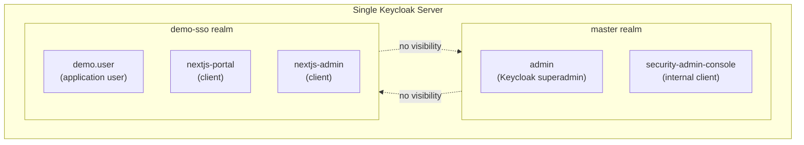

# Phase 5 — Create Realm

**Status:** ✅ Completed
**Date:** 2026-09-01

## Objective

Create a dedicated Keycloak realm, `demo-sso`, to host every identity, client, and session used by this demo — keeping it fully isolated from Keycloak's own administrative `master` realm.

## Concept: Realm

A **realm** in Keycloak is an isolated security domain: its own users, credentials, roles, groups, and clients, with no visibility into any other realm. One Keycloak server can host many realms, each behaving like a separate identity system.

## master Realm vs. Application Realm



| | `master` | `demo-sso` |
|---|---|---|
| Purpose | Administers Keycloak itself (other realms, server config) | Hosts this demo's identities and clients |
| Users | `admin` (Keycloak superadmin) | `demo.user` (created in [Phase 6](phase-06-create-user.md)) |
| Clients | `security-admin-console`, `admin-cli` (built-in) | `nextjs-portal`, `nextjs-admin` (created in Phase 7 / 14) |
| Rule | **Must never** be used as an application realm | The correct realm for this demo's authentication |

Mixing application users/clients into `master` would blur the security boundary between *who can administer Keycloak* and *who merely logs into the demo application* — a common and dangerous misconfiguration in real deployments.

## Steps

### 1. Authenticate the Admin CLI (`kcadm`)

```bash
cd C:\Keycloak\keycloak-26.7.3\bin
./kcadm.bat config credentials --server http://localhost:8088 --realm master --user admin --password admin123
```

`kcadm` is Keycloak's official command-line admin client — it talks to the same Admin REST API the web console uses, which makes every action here scriptable and reproducible.

### 2. Create the Realm

```bash
./kcadm.bat create realms -s realm=demo-sso -s enabled=true \
  -s displayName="Demo SSO Realm" -s sslRequired=external
```

| Attribute | Value | Purpose |
|---|---|---|
| `realm` | `demo-sso` | Realm identifier used in every URL, e.g. `/realms/demo-sso/...` |
| `enabled` | `true` | Realm is active and can authenticate users |
| `displayName` | `Demo SSO Realm` | Human-readable name shown in the Admin Console |
| `sslRequired` | `external` | HTTPS is required for external connections, but not for `localhost` — appropriate for local development |

### 3. Verification

```bash
./kcadm.bat get realms/demo-sso -F realm,enabled,displayName,sslRequired
./kcadm.bat get realms -F realm,enabled
```

Result — two realms now exist:

```json
[
  { "realm": "demo-sso", "enabled": true },
  { "realm": "master",   "enabled": true }
]
```

Because Keycloak is now backed by PostgreSQL (Phase 4), this realm is written directly into `keycloak_db` and will survive a Keycloak restart.

## Checkpoint

✅ Realm `demo-sso` created, enabled, and verified — persisted in `keycloak_db`. `master` remains untouched as the administrative realm. Ready to proceed to [Phase 6 — Create User](phase-06-create-user.md).
