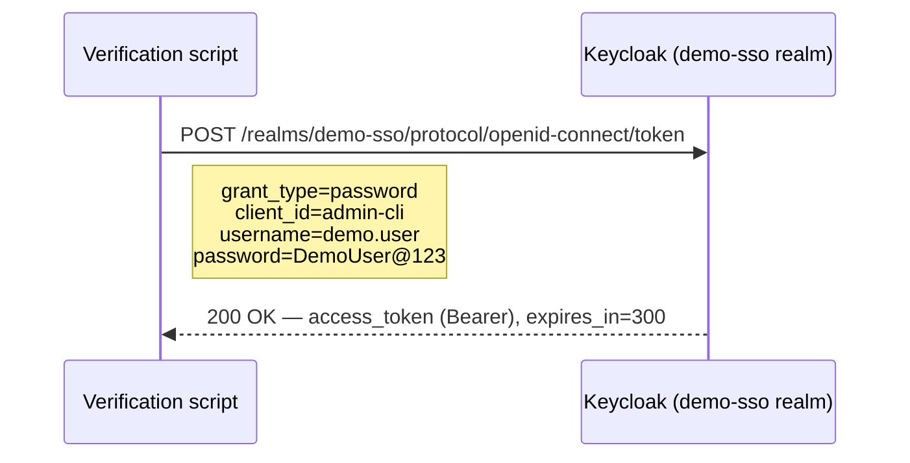

# Phase 6 — Create User

**Status:** ✅ Completed
**Date:** 2026-09-01

## Objective

Create the single demo identity, `demo.user`, inside the `demo-sso` realm, and verify it can actually authenticate and obtain a token — not just exist as a database record.

## Steps

### 1. Create the User

```bash
cd C:\Keycloak\keycloak-26.7.3\bin
./kcadm.bat create users -r demo-sso \
  -s username=demo.user \
  -s email=demo.user@example.local \
  -s emailVerified=true \
  -s enabled=true \
  -s firstName=Demo \
  -s lastName=User
```

| Attribute | Value | Purpose |
|---|---|---|
| `username` | `demo.user` | Login identifier |
| `email` | `demo.user@example.local` | Demo email, `.local` TLD to avoid implying a real mailbox |
| `emailVerified` | `true` | Skips Keycloak's email-verification requirement for this demo |
| `enabled` | `true` | Account is active immediately |

Result: user created with id `025dc481-252b-495c-87ba-1c5204ce1612`.

### 2. Set a Demo Password

```bash
./kcadm.bat set-password -r demo-sso --username demo.user \
  --new-password 'DemoUser@123' --temporary=false
```

`--temporary=false` means the user is **not** forced to change the password on first login — appropriate for a demo where the "real" first login happens through the Next.js Portal in later phases, not through the Admin Console.

> This is a demo credential only, chosen for the purpose of this walkthrough — not a real user's password.

### 3. Verify the User Record

```bash
./kcadm.bat get users -r demo-sso -q username=demo.user \
  -F id,username,email,emailVerified,enabled,firstName,lastName
```

```json
[ {
  "id": "025dc481-252b-495c-87ba-1c5204ce1612",
  "username": "demo.user",
  "firstName": "Demo",
  "lastName": "User",
  "email": "demo.user@example.local",
  "emailVerified": true,
  "enabled": true
} ]
```

### 4. Verify the Credential Actually Works (Login Test)

A record existing in Keycloak's database does not by itself prove the password was stored and hashed correctly. To confirm, an actual OIDC token request was made against the built-in `admin-cli` client using the [Resource Owner Password Credentials grant](https://www.rfc-editor.org/rfc/rfc6749#section-4.3):



```bash
curl -s -X POST "http://localhost:8088/realms/demo-sso/protocol/openid-connect/token" \
  -H "Content-Type: application/x-www-form-urlencoded" \
  -d "client_id=admin-cli" \
  -d "grant_type=password" \
  -d "username=demo.user" \
  -d "password=DemoUser@123"
```

Result: `access_token present: True`, `token_type: Bearer`, `expires_in: 300`.

**Note:** this password-grant test is a *verification technique only*, used here to confirm the account works end-to-end. It is not the flow the demo application will use — [Phase 8](phase-08-nextjs-portal.md) onward implement the proper **Authorization Code Flow**, which is the correct and secure flow for browser-based applications (see [Phase 9](phase-09-oidc-flow.md)).

## Credentials Used (Demo Only)

| Item | Value | Note |
|---|---|---|
| Username | `demo.user` | |
| Password | `DemoUser@123` | Demo password only — not a real credential |

## Checkpoint

✅ `demo.user` created in the `demo-sso` realm, enabled, with a working password verified via a real token request. This is the single user account that will be used to demonstrate SSO across both the Portal and Admin applications in [Phase 15](phase-15-sso-demonstration.md). Ready to proceed to [Phase 7 — Client `nextjs-portal`](phase-07-client-nextjs-portal.md).
