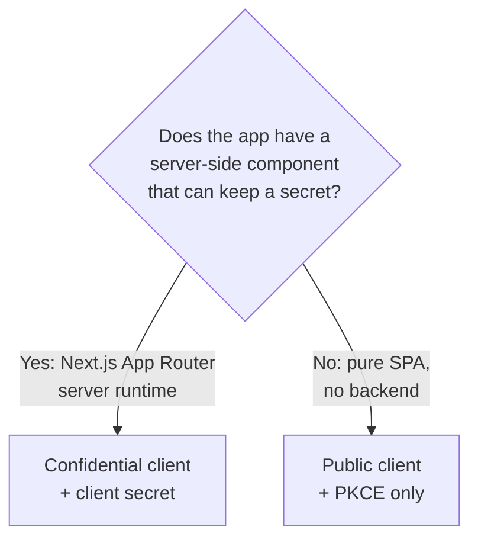

# Phase 7 — Client `nextjs-portal`

**Status:** ✅ Completed
**Date:** 2026-09-01

## Objective

Register a Keycloak client representing the Next.js Portal application, configured for the **Authorization Code Flow** — the correct and secure OIDC flow for a browser-based application with a server-side component.

## Client Type Decision: Confidential vs. Public



The Next.js Portal runs a Node.js server (App Router server components / API routes), which can safely hold a client secret outside the browser. This demo therefore registers `nextjs-portal` as a **confidential client**, with **PKCE enabled as well** for defense in depth — matching how a modern Next.js app implementing OIDC (e.g. via Auth.js/NextAuth's Keycloak provider) is typically configured.

## Client Configuration

```bash
cd C:\Keycloak\keycloak-26.7.3\bin
./kcadm.bat create clients -r demo-sso -f nextjs-portal-client.json
```

```json
{
  "clientId": "nextjs-portal",
  "name": "Next.js Portal",
  "protocol": "openid-connect",
  "publicClient": false,
  "standardFlowEnabled": true,
  "implicitFlowEnabled": false,
  "directAccessGrantsEnabled": false,
  "serviceAccountsEnabled": false,
  "redirectUris": ["http://localhost:3088/api/auth/callback/keycloak"],
  "webOrigins": ["http://localhost:3088"],
  "attributes": {
    "post.logout.redirect.uris": "http://localhost:3088",
    "pkce.code.challenge.method": "S256"
  },
  "enabled": true
}
```

## Configuration Field Reference

| Field | Value | Purpose |
|---|---|---|
| `clientId` | `nextjs-portal` | Identifier the app presents to Keycloak in every OIDC request |
| `protocol` | `openid-connect` | Uses OIDC, not SAML |
| `publicClient` | `false` | Confidential client — requires a client secret to exchange codes for tokens |
| `standardFlowEnabled` | `true` | Enables the **Authorization Code Flow** |
| `implicitFlowEnabled` | `false` | Implicit Flow is deprecated/insecure — explicitly disabled |
| `directAccessGrantsEnabled` | `false` | Disables Resource Owner Password Credentials grant — the browser app must never collect the user's password directly |
| `serviceAccountsEnabled` | `false` | This client acts on behalf of a user, not as a machine-to-machine service account |
| `redirectUris` | `http://localhost:3088/api/auth/callback/keycloak` | Exact, specific callback URL — **no wildcard**, per the mandatory rule against careless wildcard usage. This path matches the conventional Auth.js/NextAuth OIDC callback route to be implemented in Phase 8 |
| `webOrigins` | `http://localhost:3088` | Allowed CORS origin for browser-side calls to Keycloak's endpoints (e.g. silent SSO checks) |
| `post.logout.redirect.uris` | `http://localhost:3088` | Where Keycloak may redirect the browser after a logout initiated from this client |
| `pkce.code.challenge.method` | `S256` | Enforces PKCE (Proof Key for Code Exchange) even though the client is confidential — extra protection against authorization code interception |

## Why No Wildcard Redirect URIs

A redirect URI like `http://localhost:3088/*` would let Keycloak send an authorization code to *any* path on that origin, including ones an attacker could plant (e.g. via an open redirect elsewhere in the app). Registering the **exact** callback path closes that gap and follows the demo's explicit rule against careless wildcard usage.

## Client Secret Handling

The client secret was retrieved once via `kcadm`:

```bash
./kcadm.bat get clients/<client-uuid>/client-secret -r demo-sso
```

Per the mandatory rule to never display secrets in documentation or committed source:

- The secret was written to `.env.secrets.local` in the project root (a local, untracked file).
- `.gitignore` was created/updated to exclude `.env*.local` and related secret files from version control.
- The secret is **not reproduced in this document** and will only be referenced by environment-variable name (`KEYCLOAK_NEXTJS_PORTAL_CLIENT_SECRET`) from [Phase 8](phase-08-nextjs-portal.md) onward.

## Verification

Configuration was re-fetched (excluding the secret field) to confirm it matches the intended settings:

```bash
./kcadm.bat get clients/<client-uuid> -r demo-sso \
  -F clientId,protocol,publicClient,standardFlowEnabled,directAccessGrantsEnabled,redirectUris,webOrigins,enabled
```

```json
{
  "clientId": "nextjs-portal",
  "enabled": true,
  "redirectUris": ["http://localhost:3088/api/auth/callback/keycloak"],
  "webOrigins": ["http://localhost:3088"],
  "standardFlowEnabled": true,
  "directAccessGrantsEnabled": false,
  "publicClient": false,
  "protocol": "openid-connect"
}
```

## Checkpoint

✅ `nextjs-portal` client registered in the `demo-sso` realm, configured for the Authorization Code Flow with PKCE, exact redirect URI, and scoped web origins. Client secret stored securely outside version control. Ready to proceed to [Phase 8 — Next.js Portal](phase-08-nextjs-portal.md).
