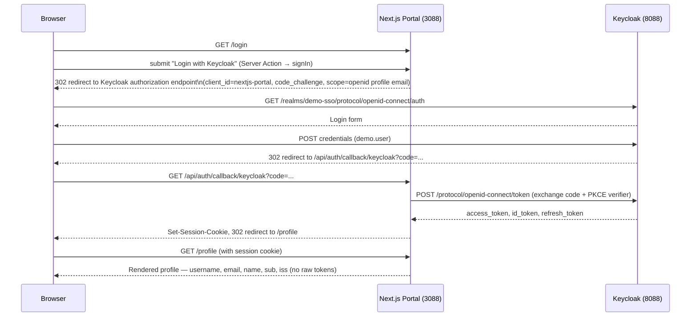

# Phase 8 — Next.js Portal

**Status:** ✅ Completed
**Date:** 2026-09-01

## Objective

Build the Next.js Portal application on port `3088`, implement OIDC login against Keycloak using the Authorization Code Flow, and expose the four required pages: `/`, `/login`, `/logout`, `/profile`.

## Tech Stack Decision

| Choice | Reason |
|---|---|
| Next.js 16 (App Router, TypeScript) | Modern Next.js convention; server components allow the OIDC token exchange to happen server-side, never in the browser |
| Auth.js (`next-auth@5` beta) with the built-in Keycloak provider | Implements the full OIDC Authorization Code Flow (+ PKCE) against Keycloak with minimal custom code, and matches the `redirectUris` registered in [Phase 7](phase-07-client-nextjs-portal.md) (`/api/auth/callback/keycloak`) |

Before writing any code, the Next.js 16 documentation bundled in `node_modules/next/dist/docs/` was consulted (the scaffold's `AGENTS.md` explicitly warns this version may differ from prior training data) to confirm Server Actions and Route Handler conventions used below are current for this version.

## Application Structure

```text
nextjs-portal/
├── src/
│   ├── auth.ts                              ← Auth.js config (Keycloak provider, callbacks)
│   └── app/
│       ├── page.tsx                         ← "/"        — home, shows session state
│       ├── login/page.tsx                   ← "/login"   — starts the OIDC flow
│       ├── logout/page.tsx                  ← "/logout"  — ends the app session
│       ├── profile/page.tsx                 ← "/profile" — displays safe identity claims
│       └── api/auth/[...nextauth]/route.ts  ← handles /api/auth/* (signin, callback, signout, session)
├── .env.local                                ← secrets (gitignored)
└── package.json                              ← dev/start scripts pinned to port 3088
```

## OIDC Login Flow (as implemented)



## Key Implementation Details

### `src/auth.ts`

```ts
export const { handlers, signIn, signOut, auth } = NextAuth({
  providers: [
    Keycloak({
      clientId: process.env.KEYCLOAK_CLIENT_ID,
      clientSecret: process.env.KEYCLOAK_CLIENT_SECRET,
      issuer: process.env.KEYCLOAK_ISSUER,
    }),
  ],
  callbacks: {
    async jwt({ token, account, profile }) {
      if (account) {
        token.accessToken = account.access_token;
        token.idToken = account.id_token;
        token.accessTokenExpires = account.expires_at ? account.expires_at * 1000 : undefined;
        token.subject = profile?.sub;
        token.issuer = account.issuer ?? process.env.KEYCLOAK_ISSUER;
        token.preferredUsername = profile?.preferred_username;
      }
      return token;
    },
    async session({ session, token }) {
      session.user.id = token.subject;
      session.issuer = token.issuer;
      session.username = token.preferredUsername;
      return session;
    },
  },
});
```

- All three Keycloak values (`clientId`, `clientSecret`, `issuer`) are read from **environment variables** — never hardcoded.
- The `jwt` callback captures `access_token` into the encrypted server-side JWT so it is available for [Phase 12](phase-12-nextjs-fastapi-integration.md) (calling FastAPI with a Bearer token) — but it is never sent to the `session` callback's return value, so **it never reaches the browser**.

### `/login` — Server Action Login Initiation

```tsx
<form action={async () => { "use server"; await signIn("keycloak", { redirectTo: "/profile" }); }}>
  <button type="submit">Login with Keycloak</button>
</form>
```

Uses a React Server Action (the current Next.js 16 pattern) rather than a client-side `onClick` handler — the redirect to Keycloak happens entirely server-side.

### `/profile` — Safe Identity Display

Only these claims are rendered:

| Claim | Source |
|---|---|
| Username | `preferred_username` from the ID token |
| Email | Standard OIDC `email` claim |
| Name | Standard OIDC `name` claim |
| Subject (`sub`) | The user's stable Keycloak identifier |
| Issuer (`iss`) | Confirms which realm issued the identity |

**Deliberately never rendered:** client secret, raw access token, refresh token, or any other credential — per the demo's mandatory security rules.

## Environment Configuration

`.env.local` (project-local, excluded from version control by the Next.js default `.gitignore`, which excludes `.env*`):

```env
AUTH_SECRET=<random 32-byte base64 value>
AUTH_URL=http://localhost:3088
AUTH_TRUST_HOST=true

KEYCLOAK_CLIENT_ID=nextjs-portal
KEYCLOAK_CLIENT_SECRET=<value from Phase 7, not reproduced here>
KEYCLOAK_ISSUER=http://localhost:8088/realms/demo-sso
```

`package.json` scripts were pinned to the project's dedicated port:

```json
"dev": "next dev --port 3088",
"start": "next start --port 3088"
```

## Verification

### 1. Server Startup

```text
- Local: http://localhost:3088
✓ Ready in 2.5s
```

### 2. Page Reachability

| Path | Unauthenticated Result |
|---|---|
| `/` | 200 — shows "not signed in" state |
| `/login` | 200 — shows login button |
| `/logout` | 307 redirect to `/` (nothing to log out of) |
| `/profile` | 307 redirect to `/login` (protected page) |

### 3. Full End-to-End Login Test

The complete Authorization Code Flow was exercised with `curl` (acting as a browser, maintaining cookies across redirects) using the `demo.user` credentials from [Phase 6](phase-06-create-user.md):

1. `POST /api/auth/signin/keycloak` (with CSRF token) → `302` to Keycloak's authorization endpoint, confirmed to contain:
   - `client_id=nextjs-portal`
   - `redirect_uri=http://localhost:3088/api/auth/callback/keycloak`
   - `code_challenge=...&code_challenge_method=S256` (PKCE active)
   - `scope=openid profile email`
2. Keycloak login form submitted with `demo.user` / the Phase 6 demo password → `302` back to the Portal's callback URL with an authorization `code`.
3. `GET /api/auth/callback/keycloak?code=...` → Next.js exchanged the code for tokens server-side and set an encrypted session cookie → `302` to `/`.
4. `GET /profile` with the session cookie returned:

```text
Username:      demo.user
Email:         demo.user@example.local
Name:          Demo User
Subject (sub): 025dc481-252b-495c-87ba-1c5204ce1612
Issuer (iss):  http://localhost:8088/realms/demo-sso
```

No access token, refresh token, or client secret appeared anywhere in the rendered page — confirmed by inspecting the raw HTML response.

## Checkpoint

✅ Next.js Portal built on port 3088, implementing the OIDC Authorization Code Flow with PKCE against Keycloak. All four pages present and functional. A full login → profile round trip was verified against the real `demo.user` account, with only safe identity claims rendered. Ready to proceed to [Phase 9 — Understanding the OIDC Flow](phase-09-oidc-flow.md).
