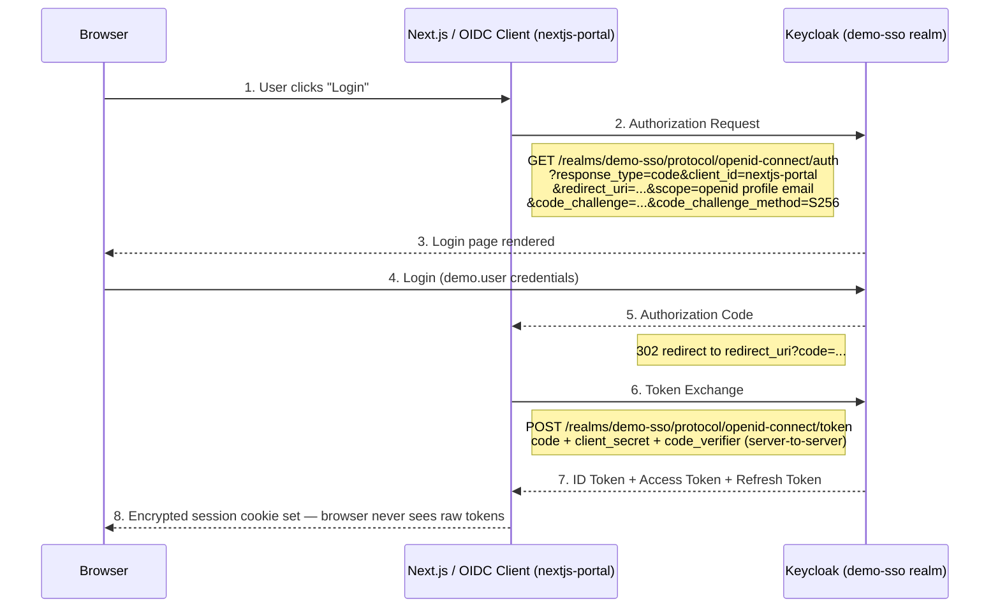
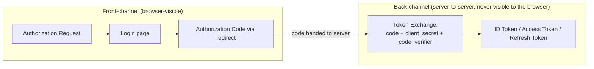

# Phase 9 — Understanding the OIDC Flow

**Status:** ✅ Completed
**Date:** 2026-09-01
**Type:** Conceptual explanation (no implementation) — grounded in the real flow observed in [Phase 8](phase-08-nextjs-portal.md)

## Objective

Explain, in detail, every step and term of the OpenID Connect Authorization Code Flow, using the actual request/response data captured while verifying the Next.js Portal login in Phase 8 — not a hypothetical example.

## The Full Flow



## Term-by-Term Explanation

### Authorization Endpoint

The Keycloak URL the browser is redirected to in order to authenticate. Observed value:

```text
http://localhost:8088/realms/demo-sso/protocol/openid-connect/auth
```

This is a **front-channel** endpoint — the browser talks to it directly, because the user needs to see and interact with the login form.

### Token Endpoint

The Keycloak URL the *application server* (never the browser) calls to exchange an authorization code for tokens:

```text
http://localhost:8088/realms/demo-sso/protocol/openid-connect/token
```

This is a **back-channel** endpoint — called server-to-server over a direct HTTP request, which is why it can safely include the confidential `client_secret`.

### Authorization Code

A short-lived, single-use code Keycloak issues after successful login, delivered to the browser via redirect and then relayed to the application:

```text
13e8626b-0b8e-b65c-fae8-fa62c7b5c680.0MEIzligWgfm5QXGZd7qkkUV.258b2082-b0c8-4f63-80bb-d59c225ab860
```

By itself, this code cannot be exchanged for tokens — it also requires the correct `client_secret` and (with PKCE) the original `code_verifier`, both of which stay server-side.

### Redirect URI

The exact URL Keycloak is allowed to send the browser back to after login. Must match, character-for-character, what was registered on the client in [Phase 7](phase-07-client-nextjs-portal.md):

```text
http://localhost:3088/api/auth/callback/keycloak
```

Enforcing an exact match (no wildcard) prevents an attacker from redirecting the authorization code to a URL they control.

### Client

The registered identity of the requesting application — how Keycloak knows *which* application is asking for a login and what it's allowed to do:

```text
nextjs-portal
```

### Scope

What categories of identity information the application is requesting:

```text
openid profile email
```

- `openid` — required to trigger the OIDC (authentication) flow at all, not just plain OAuth2 authorization.
- `profile` — requests claims like `name`, `preferred_username`.
- `email` — requests the `email` claim.

### ID Token

A JWT that answers **"who is this user?"** — the authentication result. Contains claims such as `sub` (subject/user id), `email`, `name`, `preferred_username`, `iss` (issuer), `exp` (expiry). Consumed by the application, not typically sent onward to other services.

### Access Token

A token used to answer **"what is this request allowed to do?"** — presented to APIs (FastAPI, in [Phase 11](phase-11-fastapi.md)/[12](phase-12-nextjs-fastapi-integration.md)) as a Bearer token for authorization decisions. In this implementation, it is captured into the server-side encrypted session (see the `jwt` callback in `auth.ts`) and never exposed to client-side JavaScript.

### Refresh Token

A longer-lived token used to obtain a new access token once the current one expires, without forcing the user to log in again. Also kept strictly server-side.

### Session

After the token exchange, the application (not Keycloak) establishes its own session with the browser — in this implementation, an encrypted `authjs.session-token` cookie. The browser holds only this opaque, application-specific cookie; it never sees the actual Keycloak-issued tokens.

## Front-Channel vs. Back-Channel



This separation is the core security property of the Authorization Code Flow: even though the authorization code briefly passes through the browser, it is useless on its own — turning it into real tokens requires secrets (`client_secret`, PKCE `code_verifier`) that only the legitimate server-side application holds.

## Why PKCE Matters Even for a Confidential Client

The `nextjs-portal` client is confidential (has a client secret) *and* uses PKCE (`code_challenge_method=S256`, as configured in Phase 7). PKCE adds a second, independent secret (the `code_verifier`) generated fresh for each login attempt, so that even in scenarios where an authorization code is intercepted, it still cannot be exchanged for tokens without also knowing that request-specific verifier.

## Checkpoint

✅ Every component of the OIDC Authorization Code Flow explained against real, observed request/response data from Phase 8 — Authorization Endpoint, Token Endpoint, Authorization Code, Redirect URI, Client, Scope, ID Token, Access Token, Refresh Token, and Session. Ready to proceed to [Phase 10 — JWT](phase-10-jwt.md).
