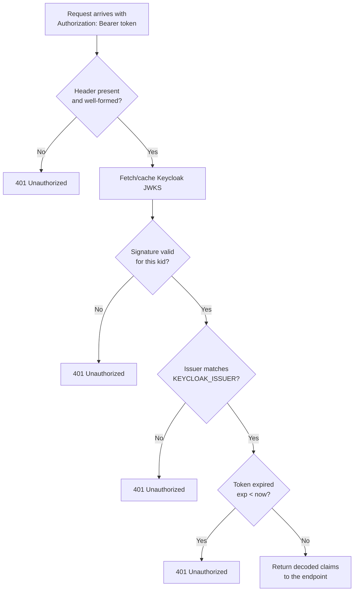
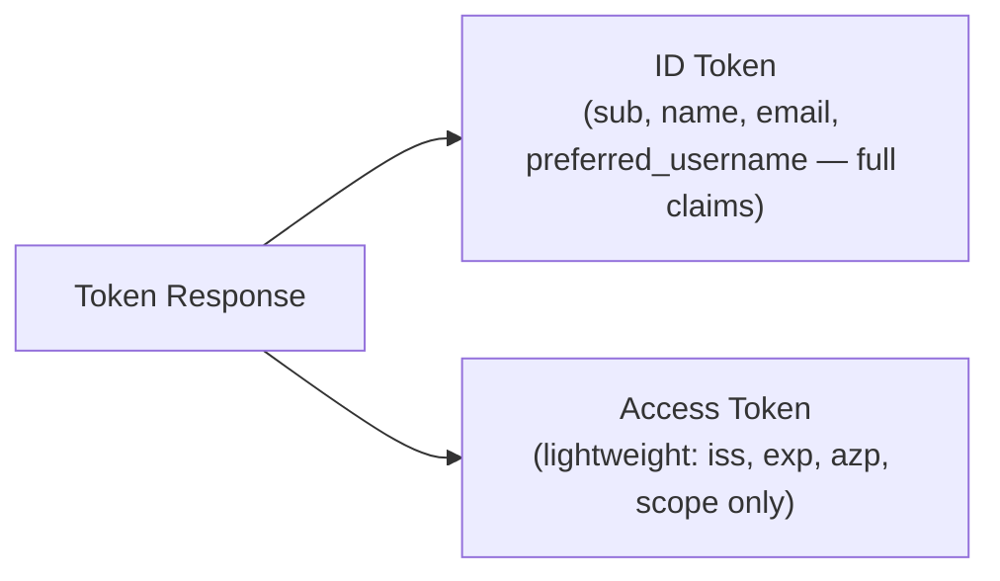

# Phase 11 — FastAPI

**Status:** ✅ Completed
**Date:** 2026-09-01

## Objective

Build the FastAPI backend on port `8089`, exposing an unauthenticated `GET /api/public` endpoint and a protected `GET /api/profile` endpoint that validates a Keycloak-issued access token presented as `Authorization: Bearer <access_token>`.

## Application Structure

```text
fastapi-app/
├── venv/              ← isolated Python virtual environment
├── main.py            ← FastAPI app, route definitions
├── jwt_auth.py         ← JWT validation against Keycloak (signature, issuer, expiration)
├── .env                ← KEYCLOAK_ISSUER, KEYCLOAK_JWKS_URL (gitignored)
└── requirements.txt
```

## Validation Design



### Signature

The token's header `kid` (key id) is matched against Keycloak's JSON Web Key Set, fetched from:

```text
http://localhost:8088/realms/demo-sso/protocol/openid-connect/certs
```

`python-jose` verifies the RS256 signature using the matching public key. The JWKS response is cached for 5 minutes to avoid a network round trip on every request while still tolerating key rotation.

### Issuer

The `iss` claim must exactly equal `KEYCLOAK_ISSUER` (`http://localhost:8088/realms/demo-sso`), preventing a token from a different realm or server from being accepted.

### Expiration

Enforced automatically by `python-jose`'s `verify_exp` option — an expired `exp` claim causes decoding to fail.

### Audience — a design decision worth documenting

Directly inspecting a real access token (a verification technique, not something shown to the end user) revealed that Keycloak's **default access token audience is `"account"`**, not the requesting client's `clientId`. The actual client identity is carried in the `azp` (authorized party) claim instead. Validating `aud == "nextjs-portal"` would therefore always fail against Keycloak's real default token shape.

The implementation follows the master prompt's own instruction — *"validate audience if used"* — by:
- Disabling strict `aud` validation (`verify_aud=False`), since this demo's tokens carry no meaningful client-specific `aud`.
- Optionally checking `azp` against an expected client id (`KEYCLOAK_EXPECTED_AZP` env var) when the caller wants to restrict which client's tokens are accepted.

## An Unexpected Finding: Lightweight Access Tokens

While testing, an access token requested for `demo.user` came back with **only** `exp, iat, jti, iss, typ, azp, sid, scope` — no `sub`, `preferred_username`, `email`, or `name`, even though the corresponding **ID token** in the same response contained all of them in full.



This is **Keycloak 26's "Lightweight Access Token"** behavior, active by default: access tokens are intentionally minimized, with rich user profile data expected to live in the ID token (or be retrieved via the UserInfo endpoint) rather than the access token. Confirming this further, a request to Keycloak's UserInfo endpoint using the lightweight access token was explicitly rejected:

```text
WWW-Authenticate: Bearer realm="demo-sso", error="invalid_token",
  error_description="Lightweight access token not allowed for userinfo endpoint"
```

### Fix Applied

Since FastAPI in this demo validates the access token itself (no extra network round trip to Keycloak per request), the `nextjs-portal` client was reconfigured to embed full claims directly in the access token:

```bash
./kcadm.bat update clients/<nextjs-portal-uuid> -r demo-sso \
  -s 'attributes."access.token.lightweight.disabled"=true'
```

After this change, a fresh access token for `demo.user` correctly included `sub`, `preferred_username`, `email`, `name`, `azp: nextjs-portal`, `aud: account`.

This client attribute change is retained going forward — it affects every future token this client requests, so no changes were needed to [Phase 7](phase-07-client-nextjs-portal.md)'s or [Phase 8](phase-08-nextjs-portal.md)'s configuration files, only Keycloak's stored client record.

## Endpoints

### `GET /api/public`

No authentication. Returns a static message.

### `GET /api/profile`

Requires `Authorization: Bearer <access_token>`. On success, returns safe claims only:

```json
{
  "message": "Token validated successfully.",
  "username": "demo.user",
  "email": "demo.user@example.local",
  "name": "Demo User",
  "subject": "025dc481-252b-495c-87ba-1c5204ce1612",
  "issuer": "http://localhost:8088/realms/demo-sso"
}
```

The raw token is never echoed back in the response.

## Verification

To obtain a realistic access token from the actual `nextjs-portal` client for testing (the client's Direct Access Grants remain disabled by design per Phase 7 — see note below), Direct Access Grants were **temporarily** enabled, a token requested, tests run, and the setting **immediately reverted** to `directAccessGrantsEnabled: false` — restoring the exact secure configuration from Phase 7.

| Test | Request | Result |
|---|---|---|
| 1 | `GET /api/public` (no auth) | `200 OK` |
| 2 | `GET /api/profile` (no `Authorization` header) | `401 Unauthorized` — "Missing Authorization: Bearer..." |
| 3 | `GET /api/profile` (malformed token) | `401 Unauthorized` — "Invalid token: Error decoding token headers." |
| 4 | `GET /api/profile` (valid `demo.user` access token, full claims) | `200 OK` — correct identity returned |

## Checkpoint

✅ FastAPI running on port 8089 with a public and a protected endpoint. JWT validation correctly checks signature, issuer, and expiration against Keycloak, with a documented, deliberate decision on audience handling. An unexpected but important Keycloak 26 behavior (lightweight access tokens) was diagnosed and resolved. The `nextjs-portal` client's security posture (Authorization Code Flow only, no direct password grants) was fully restored after testing. Ready to proceed to [Phase 12 — Next.js → FastAPI Integration](phase-12-nextjs-fastapi-integration.md).
