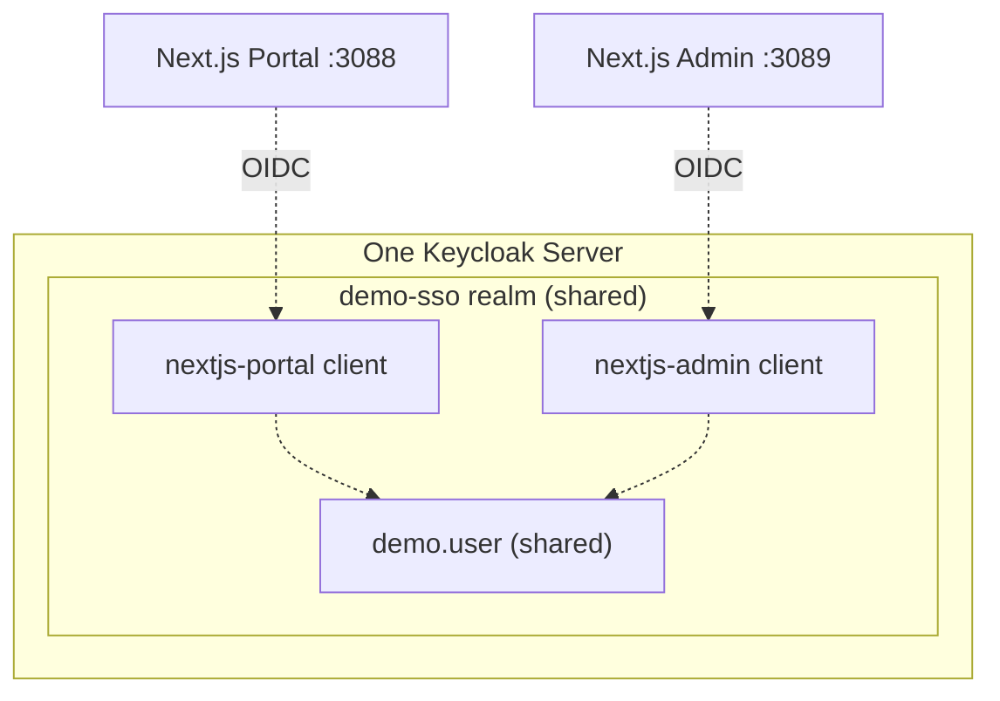

# Phase 14 — Next.js Admin

**Status:** ✅ Completed
**Date:** 2026-09-01

## Objective

Build a second frontend application, Next.js Admin (port `3089`), registered as its own Keycloak client but sharing the exact same realm (`demo-sso`) and the exact same user (`demo.user`) as the Portal — the precise setup required to observe Single Sign-On in [Phase 15](phase-15-sso-demonstration.md).

## Why a Second, Independent Client (Not a Second Keycloak)



SSO is only observable when multiple applications trust the *same* identity provider and realm. Creating a second Keycloak instance or a second realm would defeat the purpose — each app must be a distinct **client**, but all clients must point at the one shared `demo-sso` realm.

## Keycloak Client Configuration

```bash
cd C:\Keycloak\keycloak-26.7.3\bin
./kcadm.bat create clients -r demo-sso -f nextjs-admin-client.json
```

```json
{
  "clientId": "nextjs-admin",
  "protocol": "openid-connect",
  "publicClient": false,
  "standardFlowEnabled": true,
  "directAccessGrantsEnabled": false,
  "redirectUris": ["http://localhost:3089/api/auth/callback/keycloak"],
  "webOrigins": ["http://localhost:3089"],
  "attributes": {
    "post.logout.redirect.uris": "http://localhost:3089",
    "pkce.code.challenge.method": "S256",
    "access.token.lightweight.disabled": "true"
  }
}
```

Configuration mirrors [Phase 7](phase-07-client-nextjs-portal.md)'s `nextjs-portal` client exactly (confidential, Authorization Code Flow, PKCE, exact redirect URI, lightweight tokens disabled) — port `3089` in place of `3088` is the only meaningful difference. Same rigor: no wildcard redirect URIs, secret never displayed or committed, stored only in `.env.local` (untracked) and the project's `.env.secrets.local`.

## Application

Structurally identical to the Portal ([Phase 8](phase-08-nextjs-portal.md)): Next.js 16 App Router, Auth.js v5 with the Keycloak provider, pages `/`, `/login`, `/logout`, `/profile`. The home page additionally calls out what a successful SSO experience looks like, to make Phase 15's demonstration self-explanatory:

> "If you reached this page already authenticated without seeing a Keycloak login form, that is Single Sign-On working — your existing Keycloak session (established via the Portal) was recognized automatically."

`package.json` pins the dev/start scripts to port `3089`:

```json
"dev": "next dev --port 3089",
"start": "next start --port 3089"
```

## Verification

### Pages Reachable

| Path | Unauthenticated Result |
|---|---|
| `/` | `200` |
| `/login` | `200` |
| `/logout` | `307` → `/` |
| `/profile` | `307` → `/login` |

### Realm-Level Confirmation

```bash
./kcadm.bat get clients -r demo-sso -F clientId,enabled
```

The `demo-sso` realm now contains both application clients alongside Keycloak's built-ins:

```text
nextjs-admin     (enabled)
nextjs-portal    (enabled)
account, account-console, admin-cli, broker, realm-management, security-admin-console
```

No second Keycloak instance and no second realm were created — exactly as the mandatory rules require.

## Checkpoint

✅ Next.js Admin built on port 3089, registered as its own Keycloak client (`nextjs-admin`) inside the same `demo-sso` realm used by the Portal, ready to authenticate the same `demo.user` account. Ready to proceed to [Phase 15 — SSO Demonstration](phase-15-sso-demonstration.md) — the core purpose of this entire demo.
