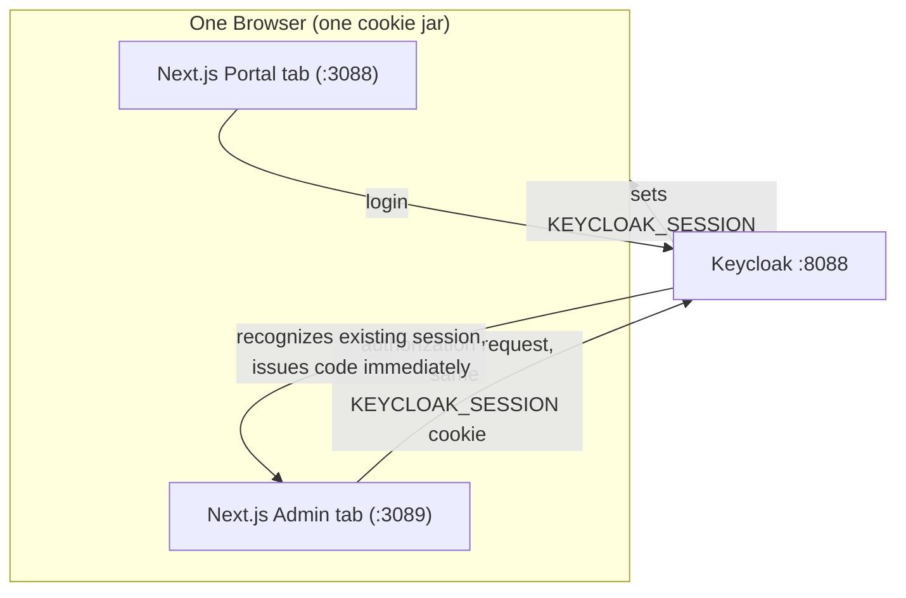
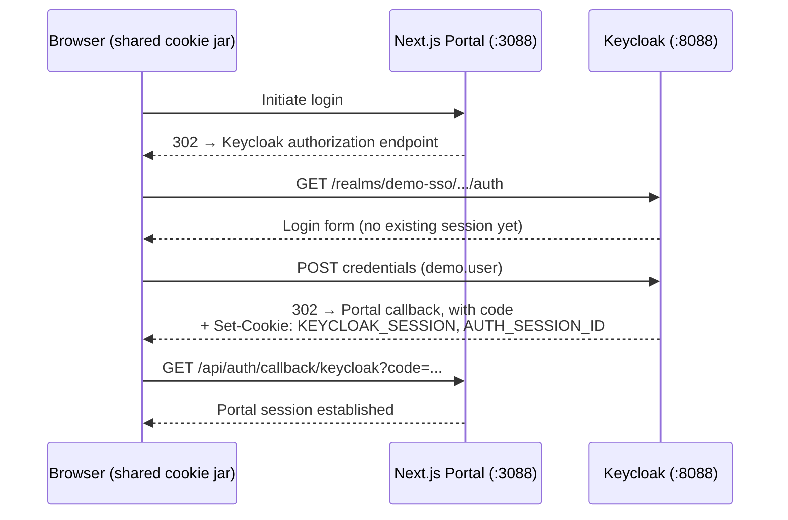
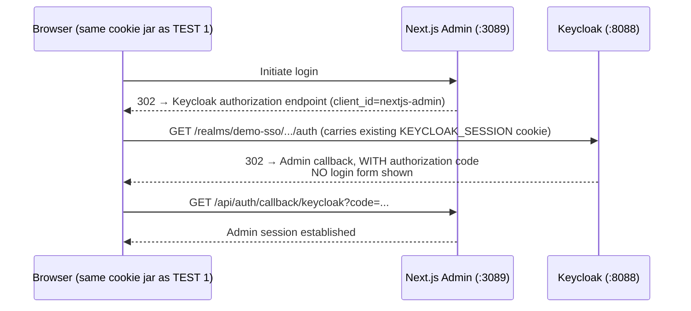
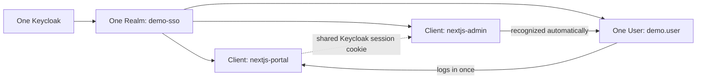

# Phase 15 — SSO Demonstration

**Status:** ✅ Completed
**Date:** 2026-09-01
**This is the core purpose of the entire demo.**

## Objective

Prove, with real HTTP evidence (not just a claim), that logging in once through the Portal grants access to the Admin app without re-entering credentials — genuine Single Sign-On via Keycloak.

## Method

A single, shared cookie jar was used across every request in this test — exactly what one browser tab (or two tabs of the same browser) would behave like. This is the critical detail: SSO only works because both applications' authorization requests reach Keycloak carrying the **same** `KEYCLOAK_SESSION` / `AUTH_SESSION_ID` cookies.



## TEST 1 — Login via Portal

The full Authorization Code Flow was exercised against the Portal (`http://localhost:3088`) using the real `demo.user` credentials from [Phase 6](phase-06-create-user.md):



Result — `GET /profile` on the Portal, with the session cookie, returned:

```text
Username:      demo.user
Email:         demo.user@example.local
Name:          Demo User
Subject (sub): 025dc481-252b-495c-87ba-1c5204ce1612
Issuer (iss):  http://localhost:8088/realms/demo-sso
```

## TEST 2 — Open Admin WITHOUT Logging Out

Without clearing any cookie, the **same** cookie jar (still holding Keycloak's session cookies from TEST 1) was used to initiate login on the Admin app (`http://localhost:3089`) — its own, separate client (`nextjs-admin`, registered in [Phase 14](phase-14-nextjs-admin.md)):



### The Decisive Evidence

Keycloak's response to the Admin app's authorization request was inspected directly. The critical question: does the `Location` header point to a **login form** (`login-actions/authenticate`) or directly to the **Admin's callback URL with an authorization code**?

```text
Location: http://localhost:3089/api/auth/callback/keycloak?session_state=RsHHyAa_J303168ZVpGxcMjP
  &iss=http%3A%2F%2Flocalhost%3A8088%2Frealms%2Fdemo-sso
  &code=8955b9e4-e87d-3128-728c-8bb720802a86.RsHHyAa_J303168ZVpGxcMjP.06124fb6-3b8c-4082-968e-ca9732efc431
```

**No login form. A code was issued immediately.** This is only possible because Keycloak recognized the existing SSO session cookie carried over from the Portal login in TEST 1.

Completing the callback and requesting the Admin's `/profile`:

```text
Username:      demo.user
Email:         demo.user@example.local
Name:          Demo User
Subject (sub): 025dc481-252b-495c-87ba-1c5204ce1612
Issuer (iss):  http://localhost:8088/realms/demo-sso
```

**No username or password was ever submitted to the Admin app or to Keycloak during TEST 2.**

## What Makes This SSO (Not Just "Login Twice")



- **One Keycloak, one realm** ([Phase 5](phase-05-create-realm.md)) — both apps trust the exact same identity source.
- **Two independent clients** ([Phase 7](phase-07-client-nextjs-portal.md), [Phase 14](phase-14-nextjs-admin.md)) — each app authenticates itself separately to Keycloak, but against the same realm.
- **One user session at Keycloak** — the `KEYCLOAK_SESSION` cookie, scoped to Keycloak's own origin (`localhost:8088`), is what both applications' browser redirects touch. Neither app ever sees the other app's session cookie — only Keycloak's shared session makes the connection.

## Checkpoint

✅ Single Sign-On demonstrated with direct HTTP evidence: after one login on the Portal, the Admin app obtained an authenticated session with zero credential re-entry, confirmed by Keycloak issuing an authorization code immediately rather than presenting a login form. Ready to proceed to [Phase 16 — Logout](phase-16-logout.md).
