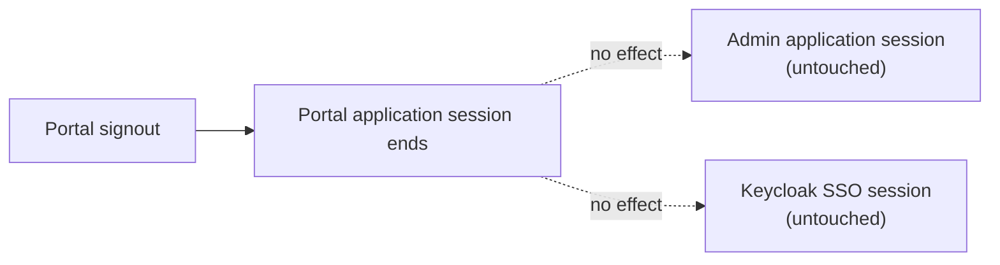
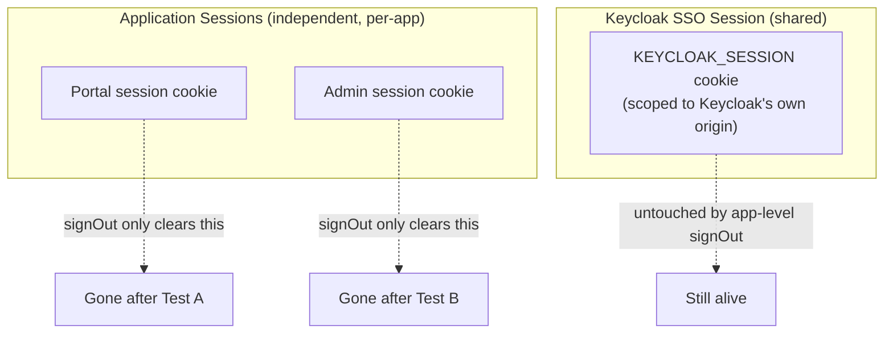
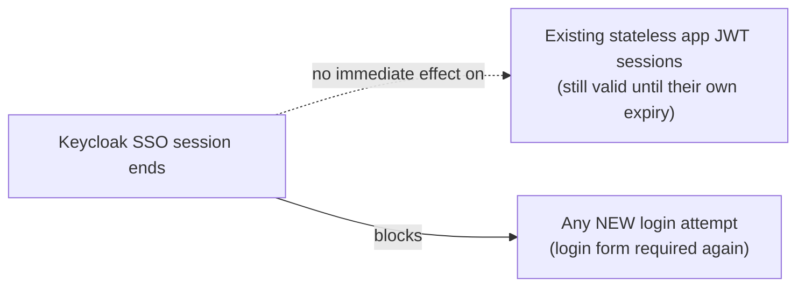

# Phase 16 — Logout

**Status:** ✅ Completed
**Date:** 2026-09-01

## Objective

Demonstrate three distinct logout scopes — logging out of the Portal only, logging out of the Admin only, and logging out of Keycloak itself — and use them to make the distinction between **Application Session** and **Keycloak SSO Session** concrete.

## Setup

To test each application's session independently while still sharing Keycloak's SSO session (mirroring how, in production, `portal.example.com` and `admin.example.com` would be separate domains sharing only the IdP's domain cookies), **separate cookie jars** were used per application, with only Keycloak-domain cookies (`localhost:8088`, path `/realms/demo-sso/`) copied between them. A single shared jar was tried first and found to cause the two apps' same-named session cookies to collide (both are host-only cookies on `localhost`, and cookies are not port-scoped) — a genuine, worth-documenting quirk of testing multiple `localhost` ports that would not occur across real distinct domains.

## TEST A — Logout from Portal

```bash
POST http://localhost:3088/api/auth/signout   # Portal's own jar
```

| Check (same request, both jars) | Result |
|---|---|
| `GET /profile` on **Portal** | `307` → session ended |
| `GET /profile` on **Admin** | `200` → **still authenticated** |



Logging out of one application's own session has **no effect** on the other application or on Keycloak's session — each app session is independent.

## TEST B — Logout from Admin

```bash
POST http://localhost:3089/api/auth/signout   # Admin's own jar
```

| Check | Result |
|---|---|
| `GET /profile` on Portal | `307` |
| `GET /profile` on Admin | `307` — both application sessions now ended |

**The decisive check:** with both application sessions gone, was Keycloak's own SSO session still alive? A fresh login attempt was initiated on the Portal, reusing only the Keycloak-domain cookies:

```text
Result: Keycloak issued an authorization code IMMEDIATELY — no login form.
```

**The Keycloak SSO session survived both application logouts.** This is the core distinction the master prompt asks to demonstrate:



| | Application Session | Keycloak SSO Session |
|---|---|---|
| Where it lives | Each app's own cookie (`authjs.session-token`) | `KEYCLOAK_SESSION` at Keycloak's origin |
| Ended by | That app's own `/api/auth/signout` | Keycloak's own logout (end-session) endpoint |
| Scope | One application only | Every application trusting this realm |

## TEST C — Logout from Keycloak

To end the actual SSO session (not just an application's local session), Keycloak's OIDC RP-initiated logout (end-session) endpoint was called:

```text
GET /realms/demo-sso/protocol/openid-connect/logout
    ?id_token_hint=<id_token>
    &client_id=nextjs-portal
    &post_logout_redirect_uri=http://localhost:3088
```

### A Debugging Detour (Worth Documenting)

The first attempts returned a Keycloak-side **500 Internal Server Error** (`NullPointerException` in `LogoutEndpoint.logoutConfirmAction`, confirmed from Keycloak's own server log). Root cause: Keycloak's logout flow first renders a **"Do you want to log out?"** confirmation page (shown whenever the request isn't from a fully browser-driven, JS-executing client), and that page's form carries a hidden `session_code` field:

```html
<form action="/realms/demo-sso/protocol/openid-connect/logout/logout-confirm?client_id=nextjs-portal&tab_id=..." method="POST">
  <input type="hidden" name="session_code" value="...">
  ...
</form>
```

The first `curl`-simulated POST omitted this field (a gap in the manual simulation, not a Keycloak defect — though returning a `500` instead of a clean `400 invalid session code` is arguably a Keycloak robustness gap). Including `session_code` in the POST body resolved it:

```bash
curl -X POST "<form action URL>" --data-urlencode "session_code=<value from the hidden field>"
```

```text
HTTP/1.1 302 Found
Set-Cookie: KEYCLOAK_IDENTITY=;Max-Age=0
Set-Cookie: KEYCLOAK_SESSION=;Max-Age=0
Location: http://localhost:3088
```

Both Keycloak session cookies were cleared (`Max-Age=0`) — the SSO session was genuinely terminated.

### Verifying Full Logout

```bash
# Fresh login attempt on the Portal, after Keycloak logout
GET /realms/demo-sso/protocol/openid-connect/auth?...
```

Result: the actual Keycloak **login form** was rendered this time — confirming no SSO session remains.

### An Additional, Important Nuance

Interestingly, `GET /profile` on both Portal and Admin **still returned `200`** immediately after the Keycloak-level logout — because neither application's own session had been explicitly signed out in this round, and Auth.js's JWT-based sessions are **stateless**: once issued, the encrypted session cookie is accepted by the app without a live round trip back to Keycloak on every request. Only when the application's own session cookie itself expires, or the user is forced through a fresh login (as demonstrated above), does the Keycloak-level logout become visible to that application.



This is a realistic and important production consideration: **logging a user out at the IdP does not instantly revoke sessions already issued by relying-party applications** unless those applications actively re-validate against Keycloak or use short-lived sessions with refresh-token rotation. This nuance is revisited in [Phase 19 — Security Review](phase-19-security-review.md).

## Checkpoint

✅ All three logout scopes demonstrated with real HTTP evidence: Test A and B showed application sessions are independent of each other and of Keycloak's own session; Test C showed a true Keycloak-level logout via the end-session endpoint (including diagnosing and resolving a real `500` error along the way), and confirmed with a fresh login attempt that required credentials again. Ready to proceed to [Phase 17 — Troubleshooting](phase-17-troubleshooting.md).
