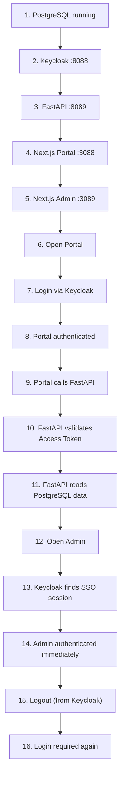

# Phase 18 — End-to-End Demo

**Status:** ✅ Completed
**Date:** 2026-09-01

## Objective

Run the full demo scenario as one continuous sequence — every service up, one real login, a real API call chain down to the database, SSO into the second app, and a full logout — as a final integration check that every prior phase still works together, not just in isolation.

## Scenario Executed

## Results

| # | Step | Result |
|---|---|---|
| 1 | PostgreSQL running | ✅ Service `Running` |
| 2 | Keycloak `:8088` | ✅ `302` (root redirect — expected, service alive) |
| 3 | FastAPI `:8089` | ✅ `200` on `/api/public` |
| 4 | Next.js Portal `:3088` | ✅ `200` |
| 5 | Next.js Admin `:3089` | ✅ `200` |
| 6 | Open Portal | ✅ |
| 7 | Login via Keycloak (`demo.user`) | ✅ Full Authorization Code Flow completed |
| 8 | Portal authenticated | ✅ `/profile` → `200` |
| 9 | Portal calls FastAPI | ✅ Via `/api/backend/profile` (Phase 12 pattern) |
| 10 | FastAPI validates Access Token | ✅ `HTTP 200` from FastAPI, embedded in Portal's `/profile` response |
| 11 | FastAPI reads PostgreSQL data | ✅ `GET /api/products` → seeded rows returned (`Demo Keyboard`, ...) |
| 12 | Open Admin | ✅ |
| 13 | Keycloak finds SSO session | ✅ Authorization response contained `code=` directly — no login form |
| 14 | Admin authenticated immediately | ✅ `/profile` → `200`, **no credentials submitted to Admin** |
| 15 | Logout (Keycloak end-session) | ✅ `KEYCLOAK_SESSION`/`KEYCLOAK_IDENTITY` cleared (`302` after confirm) |
| 16 | Login required again | ✅ Fresh login attempt rendered the real Keycloak login form |

**All 16 steps passed in one uninterrupted run**, confirming the full chain — PostgreSQL → Keycloak → Next.js Portal → FastAPI → PostgreSQL → Next.js Admin (via SSO) → logout — works end-to-end, not merely within each individual phase's isolated tests.

## Success Checklist

- [x] All five services reachable simultaneously on their assigned ports
- [x] `demo.user` can complete a real login on the Portal via the Authorization Code Flow
- [x] The Portal's `/profile` page renders identity claims without exposing any token or secret
- [x] The Portal successfully calls FastAPI with a Bearer access token (Backend-for-Frontend pattern)
- [x] FastAPI validates the token's signature, issuer, and expiration before responding
- [x] FastAPI reads real data from `demo_app_db`, independent of `keycloak_db`
- [x] Opening the Admin app, while already logged into the Portal, does **not** prompt for credentials
- [x] The Admin app correctly resolves the same identity (`demo.user`) via its own, separate Keycloak client
- [x] A Keycloak-level logout invalidates the SSO session such that a **new** login attempt requires credentials again

## Checkpoint

✅ The complete demo scenario, spanning every component built from Phase 2 through Phase 16, was executed as a single continuous run and passed all 16 steps. Ready to proceed to [Phase 19 — Security Review](phase-19-security-review.md).
