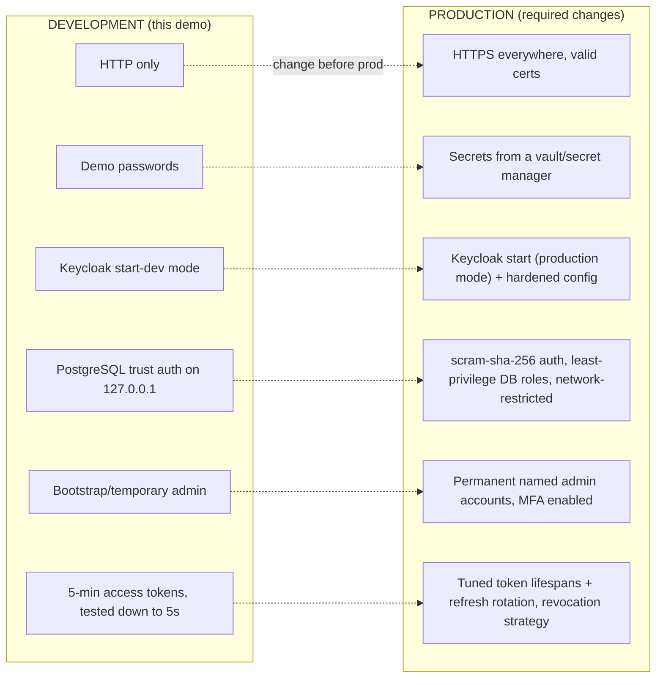

# Phase 19 — Security Review

**Status:** ✅ Completed
**Date:** 2026-09-01

## Objective

Review every security-relevant decision made across this build, and lay out precisely what must change before any of it is used beyond a local demo.

## OAuth 2.0 vs OIDC

Reiterating the distinction established in [Phase 5](phase-05-create-realm.md) and [Phase 9](phase-09-oidc-flow.md), now grounded in what was actually built:

| | OAuth 2.0 | OpenID Connect |
|---|---|---|
| Purpose | Delegated **authorization** | **Authentication** identity layer on top of OAuth 2.0 |
| Answers | "What can this token access?" | "Who is this user?" |
| Used in this demo for | Access Token → FastAPI authorization ([Phase 11](phase-11-fastapi.md)/[12](phase-12-nextjs-fastapi-integration.md)) | ID Token / login → Next.js identity ([Phase 8](phase-08-nextjs-portal.md)) |

`scope=openid ...` is what turns a plain OAuth2 request into an OIDC one — its absence was directly observed to change token shape during [Phase 11](phase-11-fastapi.md)'s investigation.

## Authorization Code Flow

Used throughout ([Phase 7](phase-07-client-nextjs-portal.md), [8](phase-08-nextjs-portal.md), [14](phase-14-nextjs-admin.md)) with PKCE (`S256`) on both clients. This is the correct flow for a server-backed web app. Implicit Flow was explicitly disabled on both clients.

## Redirect URI

Both clients register **exact** callback URLs — no wildcards ([Phase 7](phase-07-client-nextjs-portal.md)). This was reinforced by direct experience: any mismatch between the registered URI and the app's actual callback produces Keycloak's "Invalid redirect uri" error (documented in [Phase 17](phase-17-troubleshooting.md)).

## Client Configuration

- Both `nextjs-portal` and `nextjs-admin` are **confidential** clients — secrets held only server-side, never in browser-reachable code.
- `directAccessGrantsEnabled: false` by default — re-enabled only briefly, for testing, and always reverted immediately (Phases 11, 12, 16, 18).
- Client secrets: generated by Keycloak, stored only in `.env.local` (gitignored) and `.env.secrets.local` (gitignored) — never printed to documentation, never committed.

## Access Token, ID Token, Refresh Token

| Token | Where it lives in this build | Ever reaches the browser? |
|---|---|---|
| ID Token | Consumed server-side by Auth.js during callback | No |
| Access Token | Stored in the encrypted server-side session JWT; read via `getToken()` only inside Route Handlers | **No** — a design mistake putting it on the client-facing `session` object was caught and fixed in [Phase 12](phase-12-nextjs-fastapi-integration.md) |
| Refresh Token | Not actively used by this demo (short-lived 5-minute access tokens, re-login on expiry) | No |

## JWT

Validated by FastAPI on every protected request: signature (via JWKS), issuer, expiration ([Phase 11](phase-11-fastapi.md)). Audience handling was a deliberate, documented decision — Keycloak's default `aud: "account"` is not the client identity; `azp` is used instead when client-restriction matters.

## Session

Two distinct session concepts, kept intentionally separate ([Phase 16](phase-16-logout.md)):

1. **Application session** — per-app, stateless JWT cookie (Auth.js).
2. **Keycloak SSO session** — the actual authentication state, shared across every client trusting the realm.

A real gap observed: ending the Keycloak SSO session does **not** retroactively invalidate already-issued application session cookies (stateless JWTs are not re-checked against Keycloak per request). In production, mitigate with short application session lifetimes and/or periodic re-validation for sensitive actions.

## Cookies

- Auth.js sets `HttpOnly` session cookies by default — not readable by client-side JavaScript.
- A real cross-port cookie collision was discovered in [Phase 16](phase-16-logout.md): host-only cookies on `localhost` are shared across all ports of that host. This is a **testing artifact of using multiple `localhost` ports**, not a flaw in the apps themselves — production deployments on distinct subdomains do not have this issue.

## CORS

Not a live concern for the FastAPI call in this build: the browser never calls FastAPI directly ([Phase 12](phase-12-nextjs-fastapi-integration.md)'s Backend-for-Frontend design routes that call through the Next.js server). `webOrigins` on each Keycloak client is still scoped exactly to that app's own origin, not wildcarded.

## HTTPS

**Not used anywhere in this build.** Every service runs on plain HTTP over `localhost`, appropriate only for local development. See Development vs. Production below.

## Secret Management

Followed consistently throughout:
- Client secrets, database passwords, `AUTH_SECRET`: read from environment variables / `.env.local` files, never hardcoded in source.
- All `.env*` files excluded from version control (project `.gitignore` plus each Next.js app's own default `.gitignore`).
- Secrets never echoed in terminal output once captured (redacted after the one accidental echo in [Phase 7](phase-07-client-nextjs-portal.md), corrected immediately).
- No real/production passwords or tokens were ever requested from the user — only demo credentials, per the mandatory rules.

## Environment Variables

Every component reads its configuration from environment/`.env` files: Keycloak (`KC_DB_PASSWORD`, admin bootstrap credentials), Next.js (`AUTH_SECRET`, `KEYCLOAK_CLIENT_SECRET`), FastAPI (`DATABASE_URL`, `KEYCLOAK_ISSUER`). None of these are baked into container images or committed configuration — consistent with the "no Docker, but still secret-safe" constraint of this demo.

---

## Development vs. Production

| Aspect | Development (this build) | Required for Production |
|---|---|---|
| Transport | Plain HTTP (`localhost`) | HTTPS everywhere — Keycloak, Next.js, FastAPI, and all redirect/issuer URLs must be `https://` |
| Keycloak mode | `start-dev` (relaxed settings, verbose errors) | `start` with an explicit, reviewed production configuration; disable dev-only conveniences |
| Admin accounts | Temporary bootstrap admin (`admin`/demo password) | Permanent, named admin accounts; enforce MFA on the `master` realm |
| Client secrets / passwords | Demo values in local `.env` files | Sourced from a secret manager (e.g. a vault service), rotated regularly, never on developer machines in plaintext |
| PostgreSQL auth | `trust` for `127.0.0.1` (this machine's pre-existing local setup) | `scram-sha-256` everywhere, network-restricted access, least-privilege roles per service (already modeled correctly here — `keycloak_user`/`app_user` — but the *authentication method* itself must be hardened) |
| Token lifespans | Defaults, deliberately shortened to 5s for a test in Phase 12 | Tuned to real risk tolerance; add refresh-token rotation and a revocation strategy (addressing the stateless-session gap noted in Phase 16) |
| CORS / Web Origins | Scoped to `localhost` ports | Scoped to real production domains only |
| Redirect URIs | `http://localhost:*` | Exact `https://` production URLs only |
| Secrets in transcripts/docs | Actively redacted where caught | Must never appear in logs, tickets, or chat transcripts at all — treat any exposure as a rotation event |

## Checkpoint

✅ Every security-relevant mechanism built across this demo reviewed against its design intent, with the one real corrective action taken during the build (the access-token-in-client-session mistake, Phase 12) called out explicitly. A concrete Development → Production checklist produced, directly tied to the specific choices made in this build rather than generic advice. Ready to proceed to [Phase 20 — Final Documentation](phase-20-final-documentation.md).
