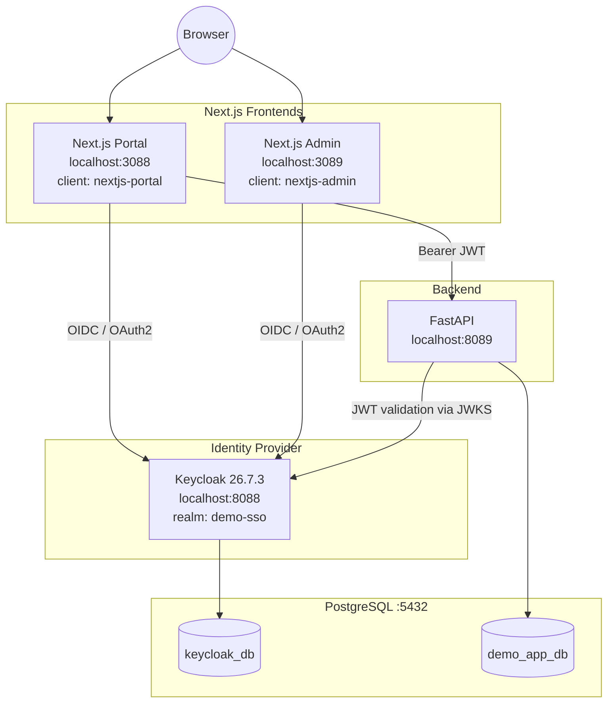

# Phase 20 — Final Documentation

**Status:** ✅ Completed
**Date:** 2026-09-01

## Objective

Consolidate the entire build into one final reference, covering all 20 documentation topics required by the master prompt, each pointing back to the phase where it was actually implemented and verified.

---

## 1. Architecture Diagram

Full detail: [docs/README.md](README.md).

## 2. Environment

Native Windows 11 Pro (64-bit), no Docker at any point. Node.js v22.18.0, Python 3.13.5, Java 21 (Oracle JDK, LTS), PostgreSQL 17.5 — all audited before any installation. → [Phase 0](phase-00-environment-audit.md), [Phase 1](phase-01-java.md)

## 3. Port Configuration

| Component | Port |
|---|---|
| Keycloak | 8088 |
| Next.js Portal | 3088 |
| Next.js Admin | 3089 |
| FastAPI | 8089 |
| PostgreSQL | 5432 |

No conflicts found; no default ports used. → [Phase 0](phase-00-environment-audit.md)

## 4. Keycloak Installation

Downloaded directly from the official GitHub release (`keycloak-26.7.3.zip`), extracted to `C:\Keycloak`, run natively via `kc.bat start-dev --http-port=8088`. → [Phase 2](phase-02-install-keycloak.md)

## 5. PostgreSQL Configuration

Two logically separated databases (`keycloak_db`, `demo_app_db`), each with its own dedicated, least-privilege user (`keycloak_user`, `app_user`). Keycloak reconfigured from its default H2 store to persist into `keycloak_db`, verified across a real restart. → [Phase 3](phase-03-postgresql.md), [Phase 4](phase-04-configure-keycloak-database.md)

## 6. Realm

`demo-sso` — isolated from Keycloak's own `master` administrative realm. → [Phase 5](phase-05-create-realm.md)

## 7. User

`demo.user`, enabled, with a demo password, verified via a real token request. → [Phase 6](phase-06-create-user.md)

## 8. Client Portal

`nextjs-portal` — confidential, Authorization Code Flow + PKCE, exact redirect URI, secret stored only in gitignored env files. → [Phase 7](phase-07-client-nextjs-portal.md)

## 9. Client Admin

`nextjs-admin` — same rigor as the Portal client, same realm, registered as an independent client. → [Phase 14](phase-14-nextjs-admin.md)

## 10. OIDC Configuration

Authorization Endpoint, Token Endpoint, scopes, and the front-channel/back-channel split explained against real captured request/response data. → [Phase 9](phase-09-oidc-flow.md)

## 11. Authorization Code Flow

Implemented for both apps via Auth.js's Keycloak provider; verified end-to-end including PKCE `code_challenge`/`code_verifier`. → [Phase 8](phase-08-nextjs-portal.md), [Phase 9](phase-09-oidc-flow.md)

## 12. JWT

Structure (`HEADER.PAYLOAD.SIGNATURE`), standard claims (`iss`, `sub`, `aud`, `exp`, `iat`, `scope`), and ID Token vs. Access Token distinction — including the real discovery that Keycloak's default access token omits profile claims (lightweight tokens). → [Phase 10](phase-10-jwt.md), [Phase 11](phase-11-fastapi.md)

## 13. FastAPI

`GET /api/public` (open), `GET /api/profile` (JWT-protected: signature, issuer, expiration validated against Keycloak's JWKS). → [Phase 11](phase-11-fastapi.md)

## 14. Next.js Portal

Pages `/`, `/login`, `/logout`, `/profile`; safe-claims-only identity display; Backend-for-Frontend call to FastAPI with the access token kept strictly server-side. → [Phase 8](phase-08-nextjs-portal.md), [Phase 12](phase-12-nextjs-fastapi-integration.md)

## 15. Next.js Admin

Structurally identical second application, independent client, same realm and user — the setup that makes SSO observable. → [Phase 14](phase-14-nextjs-admin.md)

## 16. PostgreSQL Application Database

`products` table in `demo_app_db`, exposed via `GET`/`POST /api/products`, fully isolated from `keycloak_db`. → [Phase 13](phase-13-postgresql-application-database.md)

## 17. SSO Flow

Logging in once on the Portal grants immediate access to the Admin app — proven with direct HTTP evidence (Keycloak issuing an authorization code with no login form on the second app). → [Phase 15](phase-15-sso-demonstration.md)

## 18. Logout Flow

Three distinct scopes demonstrated: per-app logout (independent), and full Keycloak logout (ends the shared SSO session) — with the Application Session vs. Keycloak SSO Session distinction proven, not just asserted. → [Phase 16](phase-16-logout.md)

## 19. Troubleshooting

18 scenarios in `SYMPTOM → CAUSE → CHECK → FIX → VERIFY` format, several grounded in issues actually hit and resolved during this build. → [Phase 17](phase-17-troubleshooting.md)

## 20. Security Recommendations

Full review of OAuth2/OIDC usage, token/session/cookie handling, secret management, and a concrete Development → Production checklist tied to this build's actual configuration. → [Phase 19](phase-19-security-review.md)

---

## Full Phase Index

See [docs/README.md](README.md) for the complete, continuously-updated phase index and baseline configuration table.

## What Was Actually Learned (Beyond the Script)

This build did not go exactly as a purely theoretical walkthrough would predict — several real, undocumented-in-advance issues were hit and resolved, which is arguably more valuable than a friction-free run:

- **JAVA_HOME shim confusion** ([Phase 1](phase-01-java.md)) — `PATH` resolving to a redirector, not an actual JDK home.
- **Keycloak 26's lightweight access tokens** ([Phase 11](phase-11-fastapi.md)) — access tokens omit profile claims by default; resolved via a client attribute, not a code workaround.
- **Default `aud` is `"account"`, not the client id** ([Phase 11](phase-11-fastapi.md)) — corrected the JWT validation design before it became a silent bug.
- **A real security mistake caught before shipping**: placing the access token on the client-facing `session` object ([Phase 12](phase-12-nextjs-fastapi-integration.md)) — fixed by switching to server-only `getToken()`.
- **Cross-port cookie collision on `localhost`** ([Phase 16](phase-16-logout.md)) — a genuine browser behavior (cookies aren't port-scoped) that shaped how logout testing had to be structured.
- **A real Keycloak 26.7.3 NullPointerException** in the logout-confirm endpoint ([Phase 16](phase-16-logout.md)), traced to a missing `session_code` form field in a hand-built request — diagnosed from Keycloak's own server logs, not guessed.
- **Power outage recovery** — mid-Phase-11 debugging survived a real power loss; every stateful component (PostgreSQL, `keycloak_db`, all Keycloak realm/client/user config) was confirmed intact on restart, validating the [Phase 4](phase-04-configure-keycloak-database.md) persistence work was not merely theoretical.

## Checkpoint

✅ All 20 required documentation topics consolidated with cross-links to their implementing phase. The demo — Keycloak + Next.js (×2) + FastAPI + PostgreSQL, fully native on Windows, no Docker — is complete: installed, configured, integrated, demonstrated end-to-end, secured on paper, and documented in full. **This concludes the master prompt.**
